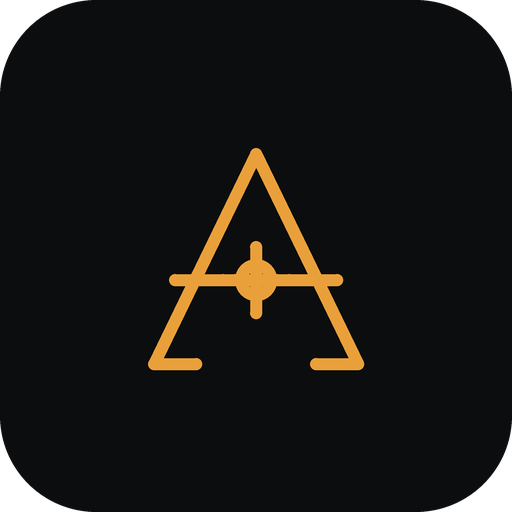

<p align="center">
  
</p>

<h1 align="center">Atlas Camera</h1>

<p align="center">
  <b>Recover the camera from a single still — up to 8K — and build a color-managed
  projection scene for Nuke, Maya and USD,<br>reviewable with simple camera moves in a
  real-time viewport.</b>
</p>

<p align="center">
  <a href="https://github.com/mikejamesvfx/atlas-camera/actions/workflows/tests.yml"></a>
  <a href="https://registry.comfy.org/nodes/atlas-camera"></a>
  <a href="LICENSE"></a>
  
  
  <a href="https://mikejamesvfx.com"></a>
</p>

---

Atlas Camera is a professional VFX tool for **single-image camera recovery and
matte-painting projection**, running as a ComfyUI custom node. A photograph goes
in; a ready camera-projection setup comes out — camera, geometry, and a
color-managed plate — for Nuke, Maya, Blender and USD.

It **solves a camera, not a mesh.** Where most 3D nodes generate geometry from an
image, Atlas does the inverse-problem, geometry-first job a projection pipeline
actually needs: recover a real, metric pinhole camera, then project the
photograph onto derived geometry. From the recovered viewpoint the plate
reassembles exactly; scale error shows only as parallax on a move — never as
smeared texture.

## What it does

1. **Solve** — recover the camera from one photograph: focal length, orientation
   and horizon, with a confidence value. A deterministic geometric solve, or a
   learned prior (GeoCalib) for harder frames.
2. **Project** — derive projection geometry (relief mesh or fitted primitives)
   and cast the plate back through the recovered camera.
3. **Review** — inspect the result and set simple camera moves — dolly, orbit,
   pan — in a real-time, fullscreen viewport, at your delivery resolution.
4. **Export** — hand off a native projection setup to Nuke (`.nk` + Python),
   Maya (`.ma`), USD, Blender, and a relief mesh (OBJ/GLB), verified in the real
   applications.

Color-managed and float-safe throughout: plates are tracked by reference in
their working colorspace (ACEScg) and bit depth (EXR 16/32-bit float), the
projection path stays floating-point, and it hands off to OpenColorIO, Nuke,
Maya and Resolve. Render format is a project-level camera up to **8192 px**.

**Runs anywhere:** the core is pure NumPy with **zero required dependencies** —
solve a camera and export to your DCC with no GPU. All 56 nodes register without
heavy dependencies; a GPU is only needed for the optional neural features.

## Install

**Clone-and-go** (simplest — no build step) — clone into ComfyUI's `custom_nodes`
and restart:

```bash
cd <ComfyUI>/custom_nodes
git clone https://github.com/mikejamesvfx/atlas-camera.git
```

Or install from the [ComfyUI Registry](https://registry.comfy.org/nodes/atlas-camera).

Dependency tiers (install only what you need):

| Tier | Install | Adds |
|---|---|---|
| **Core** | *(nothing)* | Camera solve from vanishing points, masks, DCC export — pure Python, no GPU |
| **`[vision]`** | numpy + opencv | Geometric solve with line detection + debug overlays |
| **`[neural]`** | torch + GeoCalib | Learned solve, monocular depth, depth-driven geometry, patches |

Depth Anything V2 (`V2-Metric-Outdoor`) is the default depth backend — Apache-
licensed and transformers-only, so `[neural]` needs no extra install. MoGe-2
(`[moge]`, interior specialist) and Depth Anything 3 (`[neural-da3]`; the
default on the `experimental-da3-default` branch) are selectable alternatives.
Full setup, including the research-only tier, is in **[INSTALL.md](INSTALL.md)**.

## Two distributions

- **`main`** — the working tool: camera solve, geometry derivation, the layered
  2.5D digital-matte-painting rig, viewport, and every DCC exporter. No Docker,
  no research-licensed models.
- **`experimental`** — the same codebase with two extra 🔬 nodes registered:
  `AtlasRenderFix` (NVIDIA Fixer render repair) and `AtlasPredictHiddenGeometry`
  (LaRI / World Tracing "X-ray" depth — research-only upstream, user-cloned).
  Toggle on any branch with `ATLAS_EXPERIMENTAL=1`.

## The node pack

A **58-node ComfyUI pack** (category *Atlas Camera*; 60 with the experimental
tier) covering the whole pipeline as a graph:

- **Solve** — geometric (vanishing points, no deps) and learned (GeoCalib,
  robust on AI-generated images).
- **Scale** — a tiered, confirm-to-adopt metric cascade (known-size reference →
  local-VLM cue → depth → flagged default); suggestions are never auto-promoted,
  plus `AtlasScaleOverride`, a manual scale dial for when the single-image scale
  needs a nudge.
- **Geometry** — one composable node per strategy (relief mesh, walls,
  towers/spires, roofs/facades, interior room) combined with a Nuke-Merge-style
  `AtlasMergeGeometry`, plus a project-level shot-camera format.
- **2.5D DMP layer stack** — sky-dome separation, depth-band clean plates,
  `AtlasBoundedBand` (clip a foreground at its own measured depth extent so it
  stops running away), per-pixel edge mattes and beveled skirts, and hole masks
  (the literal "where projection shows black" signal). For subject removal,
  the approved cleanplate can be depth-solved independently so road, ground,
  or architecture continues beneath the removed subject instead of dropping
  onto a far-band cliff. Inpainting stays graph-level.
- **Viewport** — `AtlasBlockoutViewport`: real-time camera-projection preview,
  camera-path authoring (dolly/orbit/pan) with baked-frame output, measured
  safe-zone orbit clamps, render passes, and diagnostic overlays (a see-through
  backdrop that fills projection gaps with the plate, and a 📏 Band Box overlay
  showing each layer's clip distance).
- **Output desk** — `AtlasRegisterPlate` / `AtlasAttachSourcePlate` carry the
  real float plate (EXR/ACEScg) past the browser preview into every exporter.
- **Export** — Nuke (`.nk` + `.py`), Maya (`.ma` + review scene), per-layer
  Nuke/Maya, USD (+ camera path), Blender, and relief mesh (OBJ/GLB with the
  projection baked into UVs).

Three ready-to-load workflows ship in [`examples/`](examples/): start with
`atlas_input_quickstart_workflow.json` (4 nodes — image in, projected relief
out), then `atlas_camera_staged_master_workflow.json` (the same logic with
stages, gates and per-layer debug). Point the LoadImage node at any photo of
your own. Beyond those, [`examples/showcase/`](examples/showcase/) holds
**eleven run-verified showcase builds** — one per scene type, together
exercising every node in the pack — with a findings report; the plates they
reference are distributed separately (any photo of your own works too). See the [technical brief](docs/TECH_AND_DIFFERENTIATION.md) for how
Atlas differs from other ComfyUI 3D systems, and the
[ecosystem guide](docs/ECOSYSTEM_GUIDE.md) for the full node catalog.

## Documentation

- [Install guide](INSTALL.md) — including the `[neural-da3]` and research-only setup
- [Technical brief](docs/TECH_AND_DIFFERENTIATION.md) — camera solve + projection vs mesh generation
- [User guide](docs/USER_GUIDE.md) · [Ecosystem guide](docs/ECOSYSTEM_GUIDE.md) — full node catalog
- [Camera moves & marketing renders](docs/CAMERA_MOVES.md) — single photo → Nuke dolly with X-ray hidden-geometry fill
- [DCC exports](docs/DCC_EXPORTS.md) · [Third-party & licenses](docs/THIRD_PARTY.md)
- **MCP server** — `pip install atlas-camera[mcp]` then `python -m atlas_camera.mcp`: drive Atlas from any MCP-capable assistant — [usage guide](docs/MCP_SERVER.md) · [design](docs/dev/archive/atlas_mcp_server_plan.md). A repo checkout auto-registers it for Claude Code via `.mcp.json`
- [Changelog](CHANGELOG.md) · [Roadmap](docs/ROADMAP.md)

## License

Atlas Camera is **[MIT](LICENSE)** — free for commercial use. It vendors nothing
restrictive; every optional model or package is installed by the user, and its
node fails soft with an informative message when absent.

Two **optional** features are the exception, and only if you enable the
experimental tier: the 🔬 hidden-geometry backends **LaRI** (no upstream license
→ all rights reserved) and **World Tracing** (CC BY-NC-ND 4.0) are
**research/non-commercial** — Atlas never redistributes them, and removing that
one node removes the restriction. Every other part of Atlas — the solve,
geometry, layer stack, viewport, and the full OpenColorIO output path — carries
no non-commercial dependency. Full map in **[THIRD_PARTY.md](THIRD_PARTY.md)**.

---

<p align="center"><sub>A <a href="https://mikejamesvfx.com">mikejamesvfx</a> tool · MIT · built for matte painters and environment artists.</sub></p>
