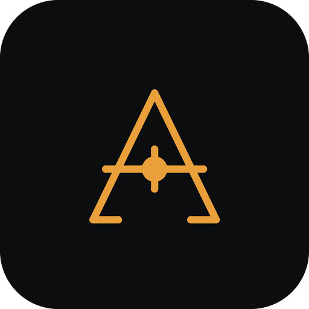

<p align="center">
  
</p>

<h1 align="center">Atlas Camera</h1>

<p align="center">
  <b>One photograph in. A metric pinhole camera and a colour-managed projection<br>
  setup out — for Nuke, Maya, USD and Blender.</b>
</p>

<p align="center">
  <a href="https://github.com/mikejamesvfx/atlas-camera/actions/workflows/tests.yml"></a>
  <a href="https://registry.comfy.org/nodes/atlas-camera"></a>
  <a href="LICENSE"></a>
  
  <a href="https://mikejamesvfx.com"></a>
</p>

---

## Start here

Install into ComfyUI, then load **[`examples/atlas_input_quickstart_workflow.json`](examples/atlas_input_quickstart_workflow.json)**.

```bash
cd <ComfyUI>/custom_nodes
git clone https://github.com/mikejamesvfx/atlas-camera.git
```

Or install from the [ComfyUI Registry](https://registry.comfy.org/nodes/atlas-camera).

That workflow is the whole tool in one node. Point its `LoadImage` at any
photograph and queue:

```
LoadImage → AtlasInput → solved camera + projection geometry + viewport
```

**`AtlasInput` is the front door.** It runs the solve, derives projection
geometry, and hands you a scene you can look through — one node, sensible
defaults, no wiring. Everything else in the pack exists to take over a stage of
that chain once you need to.

In the ComfyUI Add-Node menu, **`Atlas` holds ten numbered folders in pipeline
order** — `01 · Input & Camera` through `10 · Export` — so the menu reads as the
job rather than as an alphabet. **`Atlas/advanced`** holds every gated node
(experimental, legacy, iOS): still supported, still tested, just not where you
start.

## What comes out

1. **Solve** — the camera from one photograph: focal length, orientation and
   horizon, with a confidence value. Deterministic geometric solve, or a learned
   prior (GeoCalib) for harder frames.
2. **Project** — projection geometry (relief mesh or fitted primitives), with
   the plate cast back through the recovered camera.
3. **Review** — a real-time fullscreen viewport with simple camera moves —
   dolly, orbit, pan — at your delivery resolution.
4. **Export** — a native setup for Nuke (`.nk` + Python), Maya (`.ma`), USD,
   Blender, and a relief mesh (OBJ/GLB with the projection baked into UVs).
   Verified in the real applications.

It **solves a camera, not a mesh.** Where most 3D nodes generate geometry from an
image, Atlas does the inverse-problem job a projection pipeline actually needs:
recover a real metric pinhole camera, then project the photograph onto derived
geometry. From the recovered viewpoint the plate reassembles exactly; scale error
shows only as parallax on a move — never as smeared texture.

Colour-managed and float-safe throughout: plates are tracked by reference in
their working colourspace (ACEScg) and bit depth (EXR 16/32-bit float), the
projection path stays floating-point, and it hands off to OpenColorIO, Nuke,
Maya and Resolve. Render format is a project-level camera up to **8192 px**.

## Shoot it yourself: camera RAW → ACEScg

One photograph is still the input — but when that photograph is a **camera RAW**
off your own body, the solve stops guessing and starts measuring.

```
AtlasLoadRAW → solve (measured focal + sensor) → … → AtlasExportPlateEXR → Nuke
```

`AtlasLoadRAW` 📷 reads NEF / CR2 / CR3 / RAF / ARW through a single `rawpy`
demosaic and replaces the Adobe Camera Raw round trip entirely:

- **measured intrinsics, not inferred.** EXIF plus a curated sensor registry
  gives real focal length and sensor width, so the solve starts from the
  physical lens instead of a learned prior's estimate.
- **one demosaic, two outputs.** A display tensor for the graph and a
  scene-linear EXR sidecar, geometrically identical by construction — the
  sidecar is what the DCC gets, so nothing downstream inherits an 8-bit
  preview.
- **lens distortion handled honestly.** Optional lensfun undistort straightens
  the plate for the solve, and the Nuke export writes a `redistort_stmap.exr`
  beside the script so comp can put the distortion back over the render. Solve
  on straight lines, deliver on the real lens.

The colour path is Atlas's own, backed by OpenImageIO's built-in ACES config —
no `$OCIO` to configure and no third-party colour pack required.
`AtlasLoadPlate` reads EXR/DPX/TIFF as float, `AtlasExportPlateEXR` writes the
ACEScg handoff resolving the target space by OCIO role, and `AtlasApplyLUT`
applies a Resolve/Iridas `.cube` with a native parser. Install with `[oiio]`
and `[raw]`; see **[docs/DCC_EXPORTS.md](docs/DCC_EXPORTS.md)** and the
colour-managed section of the
**[ecosystem guide](docs/ECOSYSTEM_GUIDE.md)**.

Two or three frames instead of one? `AtlasMultiViewSolve` and
`AtlasMultiViewSolveBurst` register a short handheld burst into a calibrated
rig — the only path that yields a *measured* metric baseline rather than an
inferred one. Single-photo stays the front door; this is the upgrade when you
control the shoot.

## Install tiers

The dependency contract has three tiers: the **schema, solve JSON and DCC
exporters are dependency-free**; numerical camera recovery needs **NumPy**;
automatic line detection needs **NumPy + OpenCV** (`[vision]`). Every node
registers without heavy dependencies; a GPU is only needed for the optional
neural features.

| Tier | Install | Adds |
|---|---|---|
| **Core** | *(nothing)* | Schema, solve JSON, masks, DCC export — pure Python, no GPU |
| **`[vision]`** | numpy + opencv | Vanishing-point camera solve with line detection + debug overlays |
| **`[neural]`** | torch + GeoCalib | Learned solve, monocular depth, depth-driven geometry, patches |

Depth Anything V2 (`V2-Metric-Outdoor`) is the default depth backend — Apache-
licensed and transformers-only, so `[neural]` needs no extra install. MoGe-2
(`[moge]`, interior specialist) and Depth Anything 3 (`[neural-da3]`) are
selectable alternatives. Full setup is in **[INSTALL.md](INSTALL.md)**.

## Beyond the front door

Once `AtlasInput` isn't enough, the pack opens up stage by stage: a tiered
confirm-to-adopt metric scale cascade, composable geometry strategies combined
Nuke-Merge-style, the 2.5D matte-painting layer stack (sky dome, depth-band
clean plates, edge mattes, hole masks), camera-path authoring with baked frames,
and per-layer exports.

Rather than list them here, the full catalogue — every node, its inputs, outputs
and the rule it obeys — lives in **[docs/NODE_CATALOG.md](docs/NODE_CATALOG.md)**.
For how the pieces fit together, see the
**[ecosystem guide](docs/ECOSYSTEM_GUIDE.md)**.

Ten more workflows ship alongside the quickstart in
[`examples/`](examples/): the layered 2.5D projection stack, a same-camera
clean plate, multi-angle and ROI-registered patch repair, camera moves, export
fan-out across every DCC, burst multi-view solving, photographed hole patches
from burst frames, a RAW + multi-view + patch chain, and the Blender massing
bridge. Point any of their `LoadImage` nodes at a photograph of your own.

**Dynamic Plates** turn one time-varying region of the solved still — ocean,
cloud, smoke — into an animated projection layer. Atlas owns the shot; a video
model only makes the region move. The plate's crop camera stays fixed as the
projector, so the camera move is never baked into the generated footage. Build a
plate with `python -m atlas_camera.dynamic`, then load it into the viewport with
`Atlas Load Dynamic Plate` 🌊 — see
**[docs/DYNAMIC_PLATES.md](docs/DYNAMIC_PLATES.md)**.

Experimental nodes stay hidden unless you set `ATLAS_EXPERIMENTAL=1` before
launching ComfyUI (`ATLAS_LEGACY_NODES` and `ATLAS_IOS` gate the other two
tiers). Nothing in the default pack needs Docker or a user-cloned research
model. The experimental Blender bridge drives a headless **Blender ≥ 4.2** for
massing and mesh import — it is gated, and everything else works without it.

## Documentation

- [Install guide](INSTALL.md) — dependency tiers and optional backends
- [Technical brief](docs/TECH_AND_DIFFERENTIATION.md) — camera solve + projection vs mesh generation
- [User guide](docs/USER_GUIDE.md) · [Node catalog](docs/NODE_CATALOG.md) · [Ecosystem guide](docs/ECOSYSTEM_GUIDE.md)
- [Camera moves & marketing renders](docs/CAMERA_MOVES.md) — single photo → Nuke dolly
- [Dynamic Plates](docs/DYNAMIC_PLATES.md) — animated regions of a solved still (LTX generation optional)
- [DCC exports](docs/DCC_EXPORTS.md) — camera RAW → ACEScg EXR, the redistort STMap, per-layer Nuke/Maya scenes
- [Third-party & licenses](THIRD_PARTY.md)
- **MCP server** — `pip install atlas-camera[mcp]` then `python -m atlas_camera.mcp`: drive Atlas from any MCP-capable assistant — [usage guide](docs/MCP_SERVER.md). A repo checkout auto-registers it for Claude Code via `.mcp.json`
- [Changelog](CHANGELOG.md) · [Roadmap](docs/ROADMAP.md)

## License

Atlas Camera is **[MIT](LICENSE)** — free for commercial use. It vendors nothing
restrictive; every optional model or package is installed by the user, and its
node fails soft with an informative message when absent.

**No node Atlas registers depends on a non-commercial model.** One caveat
remains and it is yours to choose: Depth Anything V2's **large** weights are
CC BY-NC 4.0, while its small/base weights are Apache 2.0 — pick the variant
that suits your use. Everything else — the solve, geometry, layer stack,
viewport, and the full OpenColorIO output path — is unrestricted. Full map in
**[THIRD_PARTY.md](THIRD_PARTY.md)**.

---

<p align="center"><sub>A <a href="https://mikejamesvfx.com">mikejamesvfx</a> tool · MIT · built for matte painters and environment artists.</sub></p>
