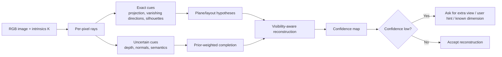

# Monocular Occlusion Geometry and Practical Reconstruction for Atlas

## Executive summary

For Atlas, the dot product between a surface normal and the viewing direction is a **local orientation test**, not a hidden-surface solver. If \(n\) is the unit surface normal and \(v\) is the unit vector from the surface point to the camera, then \(n \cdot v = \cos\theta\). Positive values mean the surface is front-facing under the chosen normal convention, zero means the view is tangent to the surface, and negative values mean back-facing. At an occluding contour or fold, the normal is orthogonal to the line of sight, so \(n \cdot v = 0\). That is the correct geometric statement behind the user’s intuition; “inverse dot product” is not the right phrase, because a dot product is a scalar, and its reciprocal is still just a scalar, not a direction. citeturn2search0turn24search11turn21view5

A single calibrated image gives you **one ray per pixel**, but not the distance along that ray. That is why monocular reconstruction is fundamentally ambiguous. Classical shape-from-shading is ill-posed and non-unique even under strong reflectance assumptions, and bas-relief-style ambiguities show that distinct 3D shapes can produce nearly identical observations under certain projections and lighting regimes. What *is* recoverable from one image are constrained quantities such as vanishing directions, affine measurements on reference planes, and structure implied by strong priors such as Manhattan layouts, symmetry, smoothness, and semantics. citeturn20view10turn23view4turn23view7turn21view9turn28view0turn28view1

For a no-GPU, NumPy-first app, the most defensible strategy is **hybrid**: keep the core geometric engine classical and explicit, use normals/depth only when they are derivable from trusted cues, and treat hidden geometry as a scored hypothesis rather than a solved fact. The most practical upgrades are structured-scene priors, sparse depth from SLAM or a short active capture sequence, and optional learned priors behind a separate inference runtime. Feature-based monocular SLAM and SfM systems exist precisely because depth cannot be recovered from a single image alone, while sparse depth samples from SLAM materially improve dense prediction. citeturn26view2turn25view8turn25view7turn26view4turn21view4

## Geometry of visibility, normals, and hidden surfaces

Assume a calibrated pinhole camera with intrinsics \(K\). For a pixel \(\tilde p = [u, v, 1]^T\), the camera ray in camera coordinates is proportional to \(K^{-1}\tilde p\). With depth \(z\), the corresponding 3D point is

\[
X_c = z K^{-1}\tilde p.
\]

COLMAP’s camera convention is convenient for Atlas because it is explicit: the stored pose maps **world to camera**, and the local camera frame uses \(x\) to the right, \(y\) downward, and \(z\) forward. The camera center in world coordinates is \(C_w = -R^T t\). citeturn18view0

Let a smooth surface be parameterized by \(X(u,v)\). Its unit normal is

\[
n = \frac{X_u \times X_v}{\|X_u \times X_v\|}.
\]

Let the unit vector from the surface point toward the camera be

\[
v = \frac{C - X}{\|C - X\|}.
\]

Then

\[
n \cdot v = \cos\theta,
\]

so the dot product is literally the cosine of the angle between the normal and the viewing direction. In the same geometric decomposition used in rendering, the component of a direction vector parallel to the normal is \((n \cdot \omega)n\), which is exactly why the sign of the dot product determines hemisphere membership. citeturn2search5turn2search0turn2search3

Under this convention, the interpretation is:

| Condition | Meaning |
|---|---|
| \(n \cdot v > 0\) | Front-facing patch under the chosen normal orientation |
| \(n \cdot v = 0\) | Grazing view; the view direction lies in the tangent plane |
| \(n \cdot v < 0\) | Back-facing patch for an opaque one-sided surface |

The important correction to the original intuition is this: **hidden surfaces are not “perpendicular to the inverse dot product.”** A more precise statement is: **surface points on an occluding boundary satisfy \(n \cdot v = 0\)**. The literature on occluding contours states this directly: a fold is the locus of points where the surface normal is orthogonal to the line of sight. Recent normal-estimation work uses the same fact operationally and notes that near occluding boundaries the normal should be perpendicular to the ray direction. citeturn24search11turn21view5turn24search15

That local condition is only **necessary**, not **sufficient**, for visibility. A point can be front-facing and still be hidden behind another surface. Rigorous visibility for an opaque scene requires two tests:

\[
\text{front-facing: } n \cdot v > 0,
\]

and

\[
\text{line-of-sight: the segment } \overline{CX} \text{ intersects the scene first at } X.
\]

In a rasterized depth map, that second condition becomes a z-buffer test: project the candidate point to pixel \((u,v)\), compare its camera-depth \(z_c\) to the stored depth at that pixel, and declare it occluded if it is farther than the visible sample by more than a tolerance. This distinction—local orientation versus global line-of-sight—is crucial for Atlas. citeturn2search2turn18view0

The **magnitude** \(|n \cdot v|\) is also useful. Values near \(1\) are near-frontal patches; values near \(0\) are grazing patches, which are exactly where reconstruction becomes numerically brittle, because projected area and local sensitivity to depth/noise worsen. The reciprocal \(1/|n \cdot v|\) can be interpreted as a **foreshortening factor**, and it blows up near the contour where \(n \cdot v \to 0\). That reciprocal is useful as a conditioning or uncertainty term, but it is not a geometric direction. citeturn2search7turn24search11

A second notation trap is the difference between the **view vector** \(v\) and the **camera ray** \(d\). If \(d\) points from the camera to the surface point, then \(d = -v\), so all signs flip:

\[
n \cdot d = -\, n \cdot v.
\]

Many codebases are cleaner if they use the camera ray because it comes directly from \(K^{-1}\tilde p\). In that case, a visible front-facing surface usually satisfies \(n \cdot d < 0\), and an occluding contour satisfies \(n \cdot d = 0\). citeturn18view0turn21view5

A useful mental picture is:

```text
camera center C
      •
      |\
      | \   view vector v = (C - X)/||C - X||
      |  \
      |   \
      |    \
      •-----\---- tangent plane at X
      X      \
       \      \
        \  n   \
         \ ⟂    \
```

At the rim or self-occluding contour, the normal lies perpendicular to the viewing direction. Just beyond that rim on the hidden side, the outward normal becomes back-facing under the same convention, but many other occluded surfaces elsewhere in the scene may still be front-facing; they are hidden because another surface wins the line-of-sight test first. citeturn24search11turn24search15

## What monocular images determine and what they do not

With one image and known intrinsics, what you know exactly is the **bundle of rays** through the camera center. For structured scenes, you can also recover useful projective and affine geometry. Single-view metrology shows that 3D affine measurements can be obtained from a single perspective image once you know minimal reference geometry such as a vanishing line for a plane and a vanishing point for a non-parallel direction. Manhattan-world models go further by using the regularity of three dominant orthogonal directions that are common in urban and indoor scenes. These are powerful in architecture, because they turn invisible layout from a pure hallucination into a constrained inference problem. citeturn20view10turn21view9turn20view11

What a single image does **not** determine in general is the depth of arbitrary points, the shape of completely unseen surfaces, or the true metric completion of regions enclosed by occlusion. Classical shape-from-shading is explicitly ill-posed: multiple surfaces can produce the same image under standard formulations, and concave-versus-convex ambiguities are a canonical failure mode. The generalized bas-relief results make the point even more sharply: from a single viewpoint there is an ambiguity in determining Euclidean surface geometry, and under orthographic or near-orthographic conditions the surface may only be recoverable up to a family of relief transformations. citeturn23view4turn23view7turn29view2

The practical implication is that monocular reconstruction always needs **priors**. The common ones are:

- **Smoothness or piecewise smoothness.** Many methods assume neighboring normals or depths vary smoothly except at boundaries. Self-supervised depth-normal work explicitly argues that natural scenes are better modeled by piecewise smooth normals than by fronto-parallel depth alone. Learned implicit reconstructions also benefit from the inductive smoothness bias of neural representations. citeturn27view0turn21view2
- **Manhattan-world and piecewise planarity.** This is especially strong for buildings, facades, rooms, floors, ceilings, and walls. Manhattan models estimate orientation from dominant orthogonal directions, and single-image normal methods such as VPLNet explicitly fuse vanishing points and line maps with normal prediction. citeturn21view9turn20view1
- **Symmetry.** Symmetry can convert one-image inference into a virtual two-view problem. Dense reconstruction from a single symmetric scene works by hallucinating a reflected camera or by enforcing equality constraints between symmetric points. Reflectional symmetry plus piecewise planarity is particularly useful for manmade objects and certain architectural interiors. citeturn28view0turn28view1
- **Semantic priors.** If a model knows a region is sky, road, floor, wall, or building, it can impose class-conditioned depth and orientation priors. Classical semantic-depth work made this explicit by encoding facts such as “sky is far” and “ground is horizontal.” citeturn27view2turn32view3
- **Learned priors.** Modern monocular models trained on mixed datasets learn deep regularities about scene geometry. MiDaS computes **relative inverse depth**, not absolute metric depth. Omnidata shows that datasets rendered or resampled from 3D scans can train strong depth and normal models; MonoSDF shows that monocular depth and normal predictions can materially improve multi-view implicit reconstruction. citeturn30view0turn25view3turn25view5turn21view4

Another important asymmetry is that **surface normals are easier than metric depth** in one image. Recent work points out that single-image normal estimation is not affected by global scale ambiguity in the way monocular depth is, because normals live on a unit sphere rather than on positive real depth values. That makes normals especially attractive for Atlas as an intermediate representation, even if absolute hidden geometry remains uncertain. citeturn32view1

A useful way to think about Atlas is:



The key design principle is that hidden surfaces should enter the system as **posterior hypotheses with confidence**, not as deterministic consequences of \(n \cdot v\). citeturn20view10turn21view9turn20view4

## Algorithms and NumPy implementations

The method families most relevant to Atlas differ sharply in what they assume and what they can guarantee.

| Method family | Inputs | Outputs | What is actually constrained | Compute profile | Atlas suitability | Primary references |
|---|---|---|---|---|---|---|
| Single-view metrology | 1 RGB image, intrinsics or geometric references, lines/vanishing points | Plane orientation, affine or metric relations on structured scenes | Strong for architecture and planar layout; weak for arbitrary curved or unseen objects | Low CPU | Excellent | Criminisi; Debevec; Manhattan-world citeturn20view10turn21view7turn21view9 |
| Shape-from-shading | 1 RGB image plus lighting/albedo assumptions | Local shape, normals, relative depth | Fine-scale geometry only if reflectance and lighting are controlled; ill-posed globally | Low to medium CPU | Conditional, fragile outdoors | Horn; Prados-Faugeras citeturn23view3turn23view4 |
| Single-image normal estimation | 1 RGB image | Dense normal map | Good local orientation prior; still no hidden-surface proof | Learned inference preferred | Good if used as a prior, not truth | DSINE; VPLNet; Omnidata citeturn20view0turn20view1turn25view5 |
| Single-image depth estimation | 1 RGB image | Relative depth, sometimes relative inverse depth | Up-to-scale and dataset-biased; ambiguous in principle | Learned inference preferred | Useful as a prior or UI hint | Eigen; MiDaS; DPT citeturn21view0turn21view1turn30view0turn25view4 |
| Surface-regularized joint depth/normal estimation | 1 RGB image | Consistent depth and normals, often plane-snapped | Better geometric consistency than direct depth alone | Medium to high | Good if you later add a learned runtime | SURGE; ASN citeturn27view1turn20view3 |
| Sparse-depth completion | RGB plus sparse depth from SLAM/sensor/user | Dense depth | Strong whenever a little true depth is available | Medium CPU if solved as linear optimization | Very good | Ma; Zhang-Funkhouser citeturn25view2turn26view5 |
| Active multi-view SfM/SLAM | Short video or multiple monocular frames with intrinsics | Camera poses, sparse cloud, optionally dense reconstruction | Best geometric identifiability; still scale-ambiguous without extra metric cue | Sparse CPU feasible; dense often heavier | Best practical hybrid | COLMAP; ORB-SLAM; ORB-SLAM3 citeturn19view7turn18view1turn25view8turn25view7 |

For Atlas as it exists today, the most realistic CPU-first stack is: **single-view metrology + plane fitting + visibility-aware reprojection + sparse-depth assimilation**. Shape-from-shading is worth using only as a local refinement term on matte, gently varying surfaces, not as the backbone of the full reconstruction. Learned depth and normal models are helpful, but they should be treated as priors with explicit uncertainty rather than as geometric fact. citeturn23view4turn20view4turn21view4

A good baseline is to keep all geometry in a COLMAP/OpenCV-like camera frame: \(x\) right, \(y\) down, \(z\) forward. That avoids sign confusion in projection and visibility tests and makes it easy to compare Atlas output to standard SfM/MVS tools. citeturn18view0

```python
import numpy as np

def backproject_depth(depth: np.ndarray, K: np.ndarray) -> np.ndarray:
    """
    Backproject a depth map into camera coordinates.

    depth: (H, W) array of positive depths along the camera Z axis.
    K:     (3, 3) intrinsics matrix.
    Returns:
        P:  (H, W, 3) points in camera coordinates, with x-right, y-down, z-forward.
    """
    H, W = depth.shape
    ys, xs = np.indices((H, W), dtype=np.float64)
    homog = np.stack([xs, ys, np.ones_like(xs)], axis=0).reshape(3, -1)  # (3, H*W)

    Kinv = np.linalg.inv(K)
    rays = Kinv @ homog                                   # unnormalized camera rays
    points = rays * depth.reshape(1, -1)                  # scale each ray by depth

    return points.T.reshape(H, W, 3)


def normals_from_depth(depth: np.ndarray, K: np.ndarray, eps: float = 1e-8) -> np.ndarray:
    """
    Estimate oriented normals from a depth map by finite differences in 3D.
    Returns normals facing the camera (so n dot ray < 0 for visible surfaces).
    """
    P = backproject_depth(depth, K)  # (H, W, 3)

    # Central differences in 3D
    dPx = np.zeros_like(P)
    dPy = np.zeros_like(P)
    dPx[:, 1:-1] = P[:, 2:] - P[:, :-2]
    dPy[1:-1, :] = P[2:, :] - P[:-2, :]

    N = np.cross(dPx, dPy)                              # arbitrary orientation
    N_norm = np.linalg.norm(N, axis=-1, keepdims=True)
    N = N / np.maximum(N_norm, eps)

    # Face normals toward the camera.
    # Camera ray from center to point is r = P / ||P||.
    # For camera-facing normals in this convention, n dot r should be negative.
    r = P / np.maximum(np.linalg.norm(P, axis=-1, keepdims=True), eps)
    flip = np.sum(N * r, axis=-1, keepdims=True) > 0.0
    N = np.where(flip, -N, N)

    # Invalidate image borders where finite differences were unavailable
    N[:, 0] = 0
    N[:, -1] = 0
    N[0, :] = 0
    N[-1, :] = 0
    return N
```

This normal-from-depth construction is the right downstream use of depth in a NumPy-only pipeline. The orientation test follows the same sign logic discussed above, while the “normal from local tangent plane” interpretation is exactly why surface normals are a natural geometry carrier for later regularization. citeturn18view0turn29view1turn32view1

```python
def qvec_to_rotmat(q: np.ndarray) -> np.ndarray:
    """
    COLMAP Hamilton quaternion (qw, qx, qy, qz) -> rotation matrix.
    """
    qw, qx, qy, qz = q.astype(np.float64)
    return np.array([
        [1 - 2*(qy*qy + qz*qz),     2*(qx*qy - qw*qz),     2*(qx*qz + qw*qy)],
        [    2*(qx*qy + qw*qz), 1 - 2*(qx*qx + qz*qz),     2*(qy*qz - qw*qx)],
        [    2*(qx*qz - qw*qy),     2*(qy*qz + qw*qx), 1 - 2*(qx*qx + qy*qy)],
    ], dtype=np.float64)


def colmap_camera_center(qvec: np.ndarray, tvec: np.ndarray) -> np.ndarray:
    """
    COLMAP stores world-to-camera pose Xc = R Xw + t.
    Camera center in world coordinates is C = -R^T t.
    """
    R = qvec_to_rotmat(qvec)
    return -R.T @ tvec


def project_world_points(Xw: np.ndarray, K: np.ndarray, R: np.ndarray, t: np.ndarray):
    """
    Project world points into a calibrated camera.

    Xw: (N, 3)
    K:  (3, 3)
    R,t define world-to-camera transform: Xc = R Xw + t
    Returns:
        uv: (N, 2) pixel coordinates
        z:  (N,) camera-space depths
        Xc: (N, 3) camera-space points
    """
    Xc = (R @ Xw.T + t.reshape(3, 1)).T
    z = Xc[:, 2]

    uv = np.empty((Xw.shape[0], 2), dtype=np.float64)
    uv[:, 0] = K[0, 0] * (Xc[:, 0] / z) + K[0, 2]
    uv[:, 1] = K[1, 1] * (Xc[:, 1] / z) + K[1, 2]
    return uv, z, Xc
```

That is the minimal COLMAP-style reprojection path Atlas needs: consistent world-to-camera transforms, correct camera centers, and explicit camera-space depths for cheirality and visibility tests. COLMAP’s documentation states exactly this pose convention and camera-center formula. citeturn18view0

```python
def visibility_test(
    Xw: np.ndarray,
    Nw: np.ndarray,
    K: np.ndarray,
    R: np.ndarray,
    t: np.ndarray,
    depth_buffer: np.ndarray,
    z_eps: float = 1e-3
):
    """
    Visibility test against a raster depth buffer.
    Returns boolean masks for front-facing, on-screen, and visible.
    """
    H, W = depth_buffer.shape
    uv, z, Xc = project_world_points(Xw, K, R, t)

    # Camera center in world coordinates
    Cw = -R.T @ t
    Vw = Cw.reshape(1, 3) - Xw
    Vw /= np.maximum(np.linalg.norm(Vw, axis=1, keepdims=True), 1e-8)

    front_facing = np.sum(Nw * Vw, axis=1) > 0.0
    in_front = z > 0.0

    ui = np.rint(uv[:, 0]).astype(int)
    vi = np.rint(uv[:, 1]).astype(int)
    on_screen = (ui >= 0) & (ui < W) & (vi >= 0) & (vi < H) & in_front

    visible = np.zeros(Xw.shape[0], dtype=bool)
    idx = np.where(on_screen & front_facing)[0]
    zb = depth_buffer[vi[idx], ui[idx]]
    visible[idx] = z[idx] <= (zb + z_eps)

    return front_facing, on_screen, visible
```

Use that test everywhere Atlas does reprojection, hole filling, or cross-view consistency. It operationalizes the difference between “facing the camera” and “actually visible.” citeturn18view0turn24search11

A particularly important limitation is that **normals alone do not solve depth completion in all cases**. Depth-completion work from Princeton gives a concrete counterexample: if a visible region is completely enclosed by occlusion boundaries, its depth can remain indeterminate with respect to the rest of the image even when surface normals are known. That matters directly for Atlas’s hidden-surface logic: a ring of plausible normals around a hole does not, by itself, prove what lies inside the hole. citeturn26view5

That said, Atlas can still implement a useful **orientation hypothesis generator** for unseen regions:

```python
def fit_plane_svd(points: np.ndarray):
    """
    Fit plane n^T x + d = 0 to 3D points with SVD.
    """
    c = points.mean(axis=0)
    _, _, Vt = np.linalg.svd(points - c, full_matrices=False)
    n = Vt[-1]
    n = n / np.linalg.norm(n)
    d = -n @ c
    return n, d


def snap_to_manhattan(n: np.ndarray, axes: np.ndarray, threshold: float = 0.94):
    """
    axes: (3, 3) orthonormal Manhattan axes.
    If n is close to one axis, snap to it.
    """
    dots = axes @ n
    k = np.argmax(np.abs(dots))
    if np.abs(dots[k]) >= threshold:
        return np.sign(dots[k]) * axes[k]
    return n
```

Then apply the following heuristic pipeline:

```text
1. Detect a hole / occluded region H and its visible boundary ring R.
2. Split R into contiguous segments without crossing strong image or depth edges.
3. Backproject valid boundary pixels to 3D.
4. Fit one or more plane hypotheses with SVD or RANSAC on each segment.
5. Optionally snap hypotheses to Manhattan axes if vanishing points support that.
6. Rank hypotheses by:
   - boundary normal agreement,
   - continuity of depth and tangent direction,
   - semantic compatibility,
   - symmetry compatibility,
   - cross-view reprojection consistency if extra frames exist.
7. Fill H with the MAP plane or a mixture of planes, and attach a confidence score.
```

This is not a theorem; it is a disciplined **hypothesis-and-score** strategy. In architecture it often works well because piecewise planarity, Manhattan alignment, and symmetry are unusually strong. That is the exact context where single-view normal work with vanishing points and classical Manhattan models show their value. citeturn20view1turn21view9turn28view0turn28view1

If Atlas later adds a learned runtime, the most useful pattern is not “predict hidden geometry directly,” but rather:

1. predict normals and relative depth from RGB,  
2. fuse them with structured cues and sparse depth,  
3. optimize a consistent geometry representation, and  
4. estimate uncertainty.  

That pattern appears repeatedly in SURGE, Adaptive Surface Normal constraints, probabilistic monocular depth, and MonoSDF-style systems. citeturn27view1turn20view3turn20view4turn21view4

## Datasets and evaluation strategy

For Atlas, it helps to distinguish **training corpora** from **evaluation benchmarks**. Training sets should expose the model or heuristic to structured indoor and outdoor geometry, while evaluation should stress the actual deployment regime: architecture, texture-poor planes, occlusion, wide-baseline failure, and camera-pose consistency. The table below prioritizes primary sources and official project pages.

| Dataset | Modalities and geometry | Why it matters for Atlas | Primary source |
|---|---|---|---|
| NYU Depth V2 | Indoor RGB-D, 1,449 densely labeled aligned RGB/depth pairs, 407k unlabeled frames | Best classic indoor benchmark for single-image depth, normals, and hole-filling logic | citeturn18view2 |
| KITTI depth benchmark | Outdoor driving RGB + LiDAR-aligned depth, 93k+ depth maps | Good for depth metrics and long-range perspective structure, though less architectural indoors | citeturn18view3 |
| ScanNet | 2.5M RGB-D views, 1,500+ scans, camera poses, meshes, semantics | Strong indoor reconstruction and normal/depth evaluation | citeturn19view0 |
| ScanNet++ | High-fidelity indoor scenes with sub-mm laser scans, DSLR images, iPhone RGB-D | Better than classic ScanNet when you care about high-quality geometry and view synthesis | citeturn19view1 |
| ETH3D | DSLR and multi-camera scenes with laser-scan-aligned evaluation | Excellent for pose, reprojection, MVS evaluation, and camera-format sanity checks | citeturn18view5turn10search19 |
| DTU MVS | 124 laboratory MVS scenes with structured-light scans and fixed camera sets | Strong controlled benchmark for reconstruction accuracy and plane fitting | citeturn18view6 |
| Tanks and Temples | Realistic indoor/outdoor laser-scanned benchmark from videos | Strong for large-scene reconstruction, occlusion, and completeness | citeturn18view8 |
| Matterport3D | 10,800 panoramic views from 194,400 RGB-D images across 90 building-scale scenes, with poses and meshes | Valuable if Atlas targets indoor architecture and room-scale completion | citeturn18view7 |
| MegaDepth | Internet-photo depth generated from SfM+MVS | Useful monocular training source for buildings and landmarks with solved cameras | citeturn25view6 |
| Hypersim | Photorealistic synthetic indoor scenes with dense geometry and camera metadata | Useful for controlled ablations, exact normals, and rendering studies | citeturn11search9turn19view2 |
| Replica | High-quality indoor reconstructions with clean meshes and semantics | Useful for synthetic-to-real prototyping and geometry-aware rendering | citeturn19view3 |
| BlendedMVS | 17k MVS training samples over 113 scenes, including architecture | Useful if you later add learned MVS or want solved-camera training at scale | citeturn19view6 |

If your immediate interest is **architectural images with solved cameras**, the highest-value subset for Atlas is usually **ETH3D, Tanks and Temples, MegaDepth, BlendedMVS, ScanNet++, and Matterport3D**, because they jointly cover accurate camera models, reconstruction benchmarks, indoor/outdoor structure, and architectural geometry. citeturn18view5turn18view8turn25view6turn19view6turn19view1turn18view7

For evaluation, use metrics that match the representation Atlas actually predicts. For **relative monocular depth**, include a scale-aware metric such as scale-invariant error if the model is only trained to recover relative structure. For standard depth benchmarks, it is common to report Abs Rel, Sq Rel, RMSE, RMSE\(_{\log}\), and \(\delta\) thresholds. For **surface normals**, report mean, median, and RMSE angular error, plus the percentage of pixels below \(11.25^\circ\), \(22.5^\circ\), and \(30^\circ\). For **3D reconstruction**, ETH3D explicitly reports accuracy, completeness, and \(F_1\), where \(F_1\) is the harmonic mean of accuracy and completeness. citeturn21view1turn31search15turn31search2turn31search0turn31search8

For Atlas specifically, benchmarking should be split into three tiers:

| Evaluation tier | What to measure | Why |
|---|---|---|
| Ray/pose correctness | Reprojection error, cheirality failures, plane-fit residuals | Verifies the geometric core before any hidden-surface reasoning |
| Visible-surface geometry | Depth and normal metrics on observed pixels only | Separates true measurement quality from hole hallucination |
| Hidden-surface completion | IoU of completed support surfaces, plane-normal error, reconstruction completeness | Tests whether priors produce useful, not merely plausible, unseen geometry |

That tiering matters because a visually plausible hole fill can still be geometrically wrong, and a correct normal field on visible pixels does not imply correct occluded completion. citeturn26view5turn31search0

## Recommendations for Atlas

The most feasible near-term roadmap for Atlas is to make the geometry engine stronger **before** adding heavier monocular learning. Your current NumPy-and-intrinsics core is a sound base, but it should be extended in the direction of **structured inference**, **visibility accounting**, and **confidence-aware completion**, not direct one-shot hidden-surface prediction. That recommendation follows directly from the identifiability limits above and from the way successful hybrid systems use normals, sparse depth, and priors together. citeturn23view4turn20view4turn21view4

A practical product roadmap looks like this:

| Atlas stage | Feasible features | Why this is realistic | Main caveat |
|---|---|---|---|
| Structured monocular core | Accurate projection/reprojection, normal-from-depth, z-buffer visibility, vanishing-point extraction, Manhattan plane fitting, user-entered known dimensions | All CPU-friendly and NumPy-appropriate | Hidden surfaces remain hypothesis-driven |
| Sparse-depth hybrid | Assimilate sparse points from SLAM, short video, or user taps; complete depth via plane/normal regularization | Sparse depth sharply reduces monocular ambiguity | Still not guaranteed in enclosed occlusions |
| Optional learned prior plug-in | Relative depth and normal priors from MiDaS/Omnidata/DSINE via ONNX/OpenVINO/TFLite/server | Large practical gain in difficult images | Requires non-NumPy runtime and careful confidence gating |
| Active multi-view mode | Prompt user for 3–20 frames with slight parallax; run SfM/SLAM; complete via plane priors | Best improvement per engineering hour | Monocular scale still needs a metric anchor |
| Heavy dense reconstruction | Full neural implicit or dense MVS | Highest quality ceiling | Usually not realistic on-device CPU-only |

The first thing Atlas should do is make a strict separation between **measured**, **derived**, and **hypothesized** geometry. Measured data are camera intrinsics, rays, user-entered dimensions, and any sparse SLAM/SfM points. Derived data are plane fits, normals from depth, and reprojected visibility. Hypothesized data are occluded surfaces, completed depths, and semantic fills. Once you keep those categories separate, your UI and export paths become much more honest and much easier to debug. citeturn18view0turn26view5

Second, Atlas should attach a **confidence map** to every hidden-surface estimate. A practical confidence score can combine:  
\(\mathbf{a}\) grazing incidence penalties from \(|n \cdot v|\),  
\(\mathbf{b}\) distance to occluding boundaries,  
\(\mathbf{c}\) plane-fit residuals,  
\(\mathbf{d}\) agreement between symmetry/Manhattan hypotheses,  
\(\mathbf{e}\) cross-view reprojection consistency when extra frames exist, and  
\(\mathbf{f}\) model uncertainty if you later add learned depth. This is exactly where probabilistic monocular depth becomes useful: not as a replacement for geometry, but as a calibrated uncertainty source. citeturn2search7turn20view4turn31search2

Third, if Atlas is meant for architecture, add **interactive priors**. A user tap on a floor-wall boundary, a symmetry axis, a known vertical, or a single known length often buys you more real identifiability than a much larger monocular model. Single-view metrology and architectural photo-modeling have shown for years that structured human or geometric cues are unusually valuable in built environments. citeturn20view10turn21view7

Fourth, Atlas should prefer **active capture** whenever confidence is low. A tiny camera translation is often dramatically more useful than any monocular guess because it turns a one-ray-per-pixel problem into a true correspondence-and-triangulation problem. Monocular SLAM systems state this bluntly: depth cannot be recovered from a single image, and they therefore require initialization and later solve scale drift with similarity constraints and loop closure. ORB-SLAM3 extends that logic to monocular, stereo, RGB-D, visual-inertial, and multi-map settings. citeturn26view2turn26view0turn25view7

The main failure modes Atlas should explicitly flag are these. **Enclosed occlusions** are not solvable from normals alone. **Texture-poor or weakly observed planar regions** remain difficult even for multi-view RGB-only reconstruction, which is one reason monocular priors improve implicit surface methods. **Global metric scale** remains ambiguous in pure monocular pipelines and drifts in monocular SLAM. **Out-of-distribution camera intrinsics** can hurt learned normal models unless ray direction is explicitly encoded. **Semantic prior errors** can push geometry the wrong way when the class prediction is wrong. citeturn26view5turn23view8turn26view0turn20view0turn32view3

Putting all of the above together, the strongest recommendation for Atlas is:

1. keep the reconstruction core explicit, geometric, and NumPy-first;  
2. use \(n \cdot v\) as a visibility-orientation cue, not as a hidden-surface rule;  
3. represent unseen surfaces as plane- or symmetry-based hypotheses with confidence;  
4. ask for extra views or sparse metric anchors whenever confidence collapses; and  
5. treat learned monocular depth/normals as optional priors that improve ranking and completion, not as proof. citeturn24search11turn23view4turn21view4turn25view2turn25view7

That architecture is rigorous enough to stay honest about monocular ambiguity, practical enough to ship on CPU, and extensible enough to absorb stronger priors later without rewriting the mathematical core. citeturn19view7turn30view1turn25view7