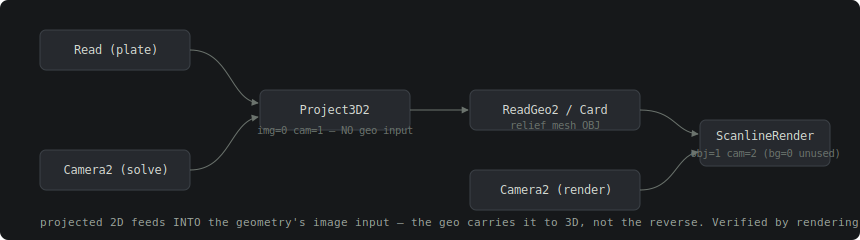

# DCC Exports

> Refreshed 2026-07-09. Everything on this page describes exporters that have been
> **verified inside the target DCC** — rendered in Nuke 16.1, executed in Maya 2027
> via mayapy, inspected sample-by-sample in USD — not designed from documentation.
> For the tuning story behind the layers these exporters carry, see the
> [Layered Projection Build-Up Guide](https://claude.ai/code/artifact/77b10784-a6d5-4def-89bd-84cbfaabc21e)
> and the [Examples Catalog](https://claude.ai/code/artifact/186c3a6a-a778-40f0-8f39-fe29cfa6aace)'s
> professional-output section.

Atlas treats DCC applications as adapters around the core solve. Two principles
govern every exporter:

1. **Coordinate conversions happen only at the adapter boundary** (Blender's Z-up,
   Maya's internal centimetres, Nuke's TCL path handling) — never in core.
2. **The viewport is a display proxy; the exporters ship the plate.** When a solve
   carries a registered source plate (`AtlasRegisterPlate` → `AtlasAttachSourcePlate`),
   the exported Read/file nodes point at the original scene-linear EXR with its true
   colorspace — full float survives to the DCC even though ComfyUI never holds it.

## What each node delivers

| Node | Deliverable | Verified how |
|---|---|---|
| `AtlasExportNuke` | Python projection script **and** a drag-and-drop native `.nk` (identical graph) | Rendered end-to-end in Nuke 16.1 via `nuke.execute()` |
| `AtlasExportNukeLayers` | Every `ProjectionSource` as one `.nk` — per-layer Read + its own Camera2 + Project3D2 + ReadGeo2 through a single Scene/ScanlineRender | Loaded + rendered in Nuke; layer overlap resolves by real z-depth |
| `AtlasExportMayaReviewScene` | Maya Python scene-builder (camera, image card, dimensioned proxies, optional relief mesh) | Executed in Maya 2027 |
| `AtlasExportMayaLayers` | **Native `.ma`** with per-layer projector cameras + an on-open scriptNode that imports the OBJs and builds the projection networks | 37 live checks via Maya 2027 mayapy |
| `AtlasExportUSD` | Static `camera.usda` | Round-trip via `AtlasUSDCameraLoader` |
| `AtlasExportCameraPathUSD` | Time-sampled animated camera from the viewport's baked move (24 fps, Y-up) | Inspected sample-by-sample after a real browser bake; errors loudly pre-bake |
| `AtlasExportReliefMesh` | Textured OBJ+MTL and/or self-contained GLB, camera projection baked into UVs; optional interior hole fill | Imported textured into Maya, Nuke, Blender |
| `AtlasExportBlender` | Python scene-builder (`build_scene.py`) with the Y-up→Z-up conversion at the boundary | Script inspection |
| `AtlasExportReviewPackage` | Full review bundle (JSON + overlays + docs) | — |

## Relief mesh — closing interior tear holes for the DCC

Atlas relief meshes are **deliberately torn** at depth discontinuities, so the
live 📽 projection never rubber-sheets background onto foreground. That is
load-bearing and unchanged. But the mesh you hand a DCC is a different artifact
from the one the viewport projects: small interior tear holes (depth noise, fine
structure, band-clip seams) become stray open boundaries that block retopo,
booleans and 3D-print prep in Maya / ZBrush / Blender.

`AtlasExportReliefMesh.fill_interior_holes` (default **off** — a torn silhouette
is the DMP-correct look) caps them **in the export only**. The live projection
mesh and the solve's own geometry are never touched, and fills reuse existing
vertices only, so the projection baked into the UVs stays valid on filled faces.

**Only interior enclosed loops fill — never the outer silhouette/frame.** Two
composable scopes:

| Widget | Default | What it does |
|---|---|---|
| `fill_interior_holes` | off | Master switch. |
| `max_hole_edges` | 64 | A loop fills only if its edge count is below this. The frame perimeter is ~512 edges at grid 128 while tears are ~4–30, so 64 separates them by construction. The single largest loop is always left open as a backstop. |
| `fill_depth_near_m` / `fill_depth_far_m` | 0 / 0 (off) | **Band box.** A loop fills only if *every* one of its boundary vertices sits within `[near, far]` metres of the recovered camera. Transcribe the near depth and `AtlasBoundedBand`'s `cutoff_m`. |

The band box is the cleaner way to say "fill holes inside the subject": the frame
spans near-to-far, so it falls outside the window automatically, and background /
sky holes beyond the cutoff stay open — which is what you want. Note both bounds
must be **> 0**; a `0` means "window not set" and falls back to edge-count only.

**What it guarantees.** A fill may leave a hole open, but it will never make the
mesh worse than not filling: no back-facing faces, no zero-area slivers, no
non-manifold edges. A hole it cannot triangulate cleanly is simply left open.
Measured against a real export, filling adds none of those three defects, and
`is_winding_consistent` stays true.

**Seeing it before Maya.** The fill is invisible in the viewport by design — the
live projection mesh must keep its tears. So the node reports on itself:

```
🔧 interior hole fill: ON
  filled 12 holes (4–18 edges, +31 faces)
  still open: 4 boundary loops (the outer frame is one)
  scope: max_hole_edges=64, band box 2.1–18.4 m
```

If that says `filled 0 holes`, read the scope line — a disappointing fill is
almost always a too-tight scope, not a failed fill. To *see* the geometry, wire
the **`preview_solve`** output into an `AtlasBlockoutViewport`: it carries the
mesh that was actually written, off the same widgets, so what you tune is what
lands in the DCC. Your input solve (and everything downstream of it) is
untouched, so the main viewport keeps showing the real torn projection.

**What it is not.** This is purely topological — it caps holes that already
exist. It does **not** predict geometry hidden behind an occluder; that is the
experimental `AtlasPredictHiddenGeometry` (LaRI / World-Tracing) track. The two
are complementary: this repairs what's there, that invents what isn't. If you
only need a clean mesh for a DCC, you no longer need the experimental branch.

## Nuke — the verified projection topology

The projection graph was corrected by *building it live* in Nuke 16.1 with
`nuke.createNode()` and probing each node's real knobs and inputs. Reading the
docs produced a plausible-looking graph; running it surfaced four real bugs:



1. **`Card3D` has no `xsize`/`ysize`** — it's a lens-driven camera billboard. An
   arbitrary-sized ground plane is a plain `Card` scaled via the universal
   `scaling` knobs.
2. **`ScanlineRender` has no `format` knob** — render resolution is a Root
   (project) setting.
3. **The topology direction**: `Project3D2` is a 2-input node (img, cam) with *no
   geometry input* — it bakes the camera view into the 2D stream, which then feeds
   **into the geometry's own image input**. And ScanlineRender's inputs are
   **bg=0, obj=1, cam=2** — the old obj=0/cam=1 wiring silently connected nothing
   (`canSetInput()` returns False).
4. **Windows paths corrupt through `knob.setValue()`** — Nuke runs values through
   TCL escaping and eats `\U`, `\A`, … sequences. All paths are normalised to
   forward slashes before being set.

The native `.nk` writer reproduces the same graph as plain text. One genuine
limitation of `.nk`'s push/pop stack serialization — reusing the same Camera2 a
second time for ScanlineRender's cam slot never re-resolves reliably — is closed
by a one-line `onScriptLoad` callback on Root, so the file stays self-contained.
Output was confirmed **byte-identical** across the `.py` path, the `.nk` path,
and a hand-built live-API graph.

**Real geometry:** wire `AtlasExportReliefMesh`'s `obj_path` into
`relief_mesh_obj_path` and the flat Card is replaced by a `ReadGeo2` loading the
actual derived relief mesh. Two gotchas found live: Nuke never auto-applies an
OBJ/MTL's `map_Kd` texture (a bare ReadGeo2 renders black — the projection wiring
provides the image input anyway), and the graph deliberately stays live-projected
rather than relying on the mesh's baked UVs, because a static bake can't black
out geometry outside the recovered frustum or re-project a swapped plate.

### The layers export

`AtlasExportNukeLayers` materialises **every** `ProjectionSource` — sky dome,
clean-plate bands, X-ray layer, patches — through the shared
`exporters/_layers.collect_projection_layers()` collection:

- each layer gets its **own** Camera2 (patches orbit; outpainted skies carry a
  widened cx/cy+P camera whose `layer_focal_mm` self-corrects to the wider FOV);
- mattes ride **embedded in the plate's alpha** and as standalone
  `{layer}_matte.png` files;
- **invented pixels are declared**: each layer's edge-extend/outpaint region ships
  as `{layer}_extend_matte.png` with a labeled, deliberately-unwired Read and a
  StickyNote ("invented pixels — use as a mask to regrain / degrade / replace") so
  the compositor decides its treatment.
- the **render camera is animatable**: it uses `translate`/`rotate` +
  `rot_order XYZ` (not `useMatrix`, which greys out the channels), so you can
  keyframe a camera move — dolly it and occluded areas fill from the X-ray layer
  instead of tearing to black. `Root.onScriptLoad` auto-wires it into
  `ScanlineRender` on open. Each band also gets a `resize none` conform Reformat
  so a swapped original-resolution EXR fits the band's (outpainted) projection
  format.

## Maya — native `.ma`, verified live

`AtlasExportMayaLayers` writes one `.ma` where everything static text can express
is a native node (per-layer projector cameras via `_matrix_to_maya_trs`
Euler-xyz decomposition, round-trip-tested to 1e-9), plus one on-open scriptNode
for what it can't (OBJ imports + shading networks). Running it in a real Maya
caught two API facts now baked into **both** Maya exporters:

- the `projection` node has **no focalLength/aperture attributes** — its
  perspective frustum comes solely from `cameraShape.message →
  projection.linkedCamera`;
- Maya's OBJ importer lands raw values as internal **centimetres** regardless of
  the scene's declared metre unit — imported layer groups get a ×100 scale,
  applied **about the world origin** (the scriptNode zeroes the group pivots
  first; scaling about the import pivot instead left every band collapsed onto
  the camera and the projection tiled — fixed 2026-07-13).

Mattes ride plate alpha → `file.outTransparency` → `lambert.transparency`, the
same doctrine as the Nuke export, because both consume the identical shared layer
collection — the two DCCs cannot drift.

## USD

- `AtlasExportUSD` writes the static solved camera.
- `AtlasExportCameraPathUSD` writes the **animated** camera authored in the
  viewport's 🎥 Camera Path mode (`Usd.TimeCode`-keyed samples, 24 fps, Y-up,
  stage axis set at export time). It takes the viewport's `camera_path` output —
  bake first (⏺), or it raises rather than writing an empty stage.
- The USD dependency stays optional and lazy: missing `usd-core` never breaks a
  plain Atlas import.

## Blender

Blender is Z-up; Atlas core is Y-up. The exporter converts at the boundary and
writes a `build_scene.py` scene-builder (camera + plate + ground). It has not yet
been extended to the per-layer `ProjectionSource` model — the layers story is
currently Nuke + Maya.

## Houdini

Not scaffolded. The likely path remains USD-first (the animated camera path
already imports), followed by a native helper script if artist workflow needs it.

## Color management

The exporters read `solve.source_plate` (colorspace, bit depth, LUT, proxy flag)
and the optional `output_profile` wire. A plate registered without a real file
path is stamped `is_proxy=true` and will never be mistaken for finals. The
`ocio_full_float_hangar` example proves the full chain: a 3840×2160 32-bit ACEScg
EXR through the ComfyUI solve/preview (as an sRGB display proxy) to a Nuke script
whose Read points at the original EXR with `colorspace='ACEScg'`.
