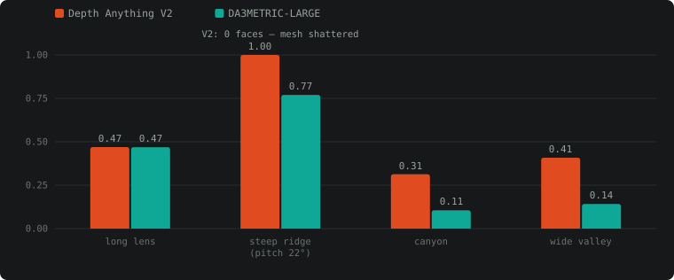
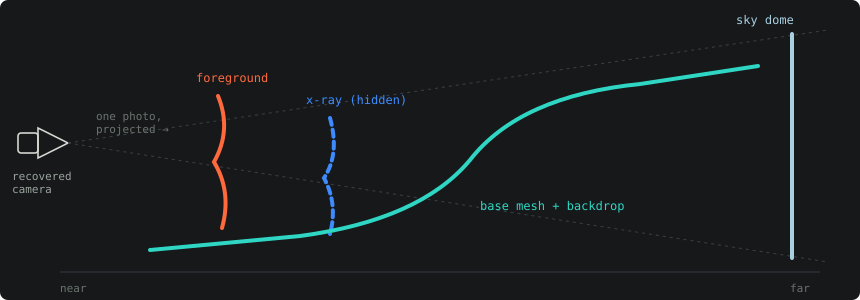
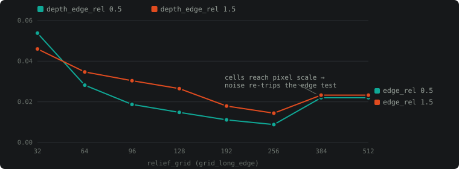
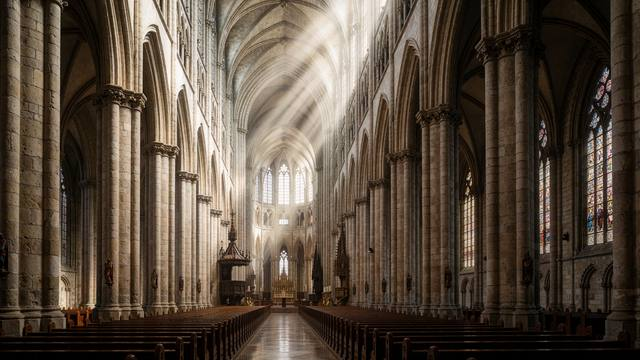
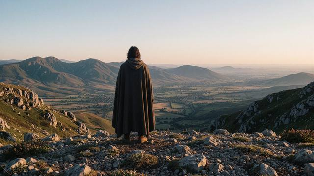
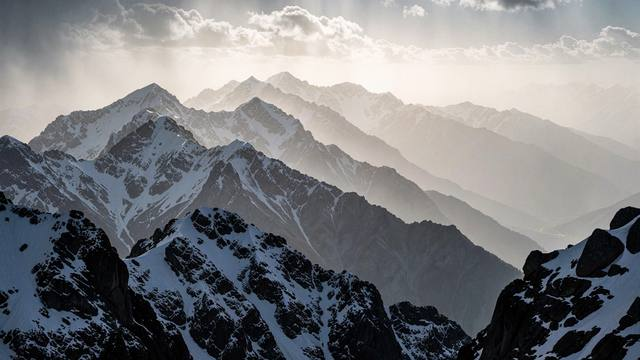
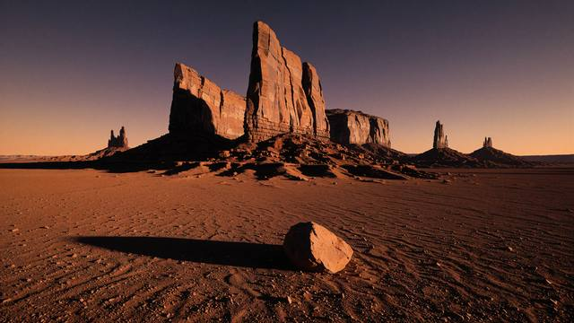

# Atlas Camera — Ecosystem Guide

This is the comprehensive, whole-system companion to [docs/USER_GUIDE.md](USER_GUIDE.md)
(which stays focused and artist-facing on the three core mental models: recovery,
projection, and preview dilation). This guide covers everything USER_GUIDE.md
doesn't: the full node catalog, every geometry-derivation and multi-angle-patch
strategy, the improvements and fixes made in the 2026-07-03/04 work session, and
the new VFX color-managed output path via ComfyUI-OCIO.

If you're new to the project, read USER_GUIDE.md's Part 1–3 first for the core
mental model, then come back here for the rest of the map.

---

## 1. What Atlas Camera Is

Atlas Camera answers one question — *given a single photo, where was the camera,
what lens was it, how big is the scene, and what 3D geometry can I build to paint
that photo onto* — and carries the answer through one consistent through-line:

```
RECOVER  →  DERIVE  →  PROJECT  →  EXPORT
(camera)    (geometry)  (live)     (DCC handoff)
```

- **Recover** — solve a camera (position, orientation, focal length, metric
  scale) from one image, via a classical vanishing-point method or a learned
  neural prior.
- **Derive** — build simple 3D geometry (a depth relief mesh, or fitted
  primitives: walls, planes, room boxes) that receives a camera projection.
- **Project** — paint the source photo onto that geometry from the recovered
  camera's exact point of view, live, in a ComfyUI viewport — the same
  technique matte painters use in Nuke or Maya, but interactive and immediate.
- **Export** — hand the solved camera and/or textured geometry off to Maya,
  Nuke, Blender, USD, or a plain review package, with the projection already
  baked into the mesh's UVs.

### Package layout

```
atlas_camera.core       ← DCC-agnostic schema, solver, math (zero required deps)
atlas_camera.exporters  ← Maya, Blender, Nuke, USD, review package writers
atlas_camera.importers  ← Atlas JSON and USD camera loaders
atlas_camera.comfy      ← ComfyUI node library (count in docs/NODE_CATALOG.md; experimental tier behind ATLAS_EXPERIMENTAL)
atlas_camera.ui         ← Optional FastAPI project service + React/Three.js workbench
atlas_camera.reference_data ← Curated scale-reference registry (person/door/car/etc.)
atlas_camera.inference  ← Depth Anything V2, GeoCalib, local VLM helpers
```

### Is my scale safe to export? (the trust tier, 2026-07-18)

A projection can look perfect while the metric scale is silently wrong —
projection is angular; scale is not. Every solve now carries a
`scale_health` verdict (measured / manual / assumed / unknown + an explicit
safe-to-export flag) derived from the tiered scale cascade's own provenance:
the viewport ℹ HUD shows an orange ⚠ when scale is unverified, the ✅ Solve
Gate report says why, export summaries carry the warning, and
`AtlasSceneHealthGate` 🩺 (the acknowledgement gate before the exporters)
holds the solve on any red flag until you fix it or knowingly continue —
the acknowledged report rides into every export and the `atlas_project.json`
reproducibility manifest. Fix an assumed scale with 📐 `AtlasScaleOverride`
(camera height = floors × ~3.2 m on elevated plates) or a scale reference.

The core package has **zero required runtime dependencies**. Every optional
capability (numpy/opencv vision math, USD export, the FastAPI UI, the neural
solvers) is guarded by `try/except` with an actionable `pip install -e .[extra]`
message — nothing silently degrades without telling you why.

### Installing

```powershell
pip install -e ".[dev]"                                   # numpy, opencv, pytest
pip install -e ".[neural]"                                 # torch (expected from host env) + GeoCalib
pip install "git+https://github.com/cvg/GeoCalib.git"      # GeoCalib is GitHub-only
pip install -e ".[usd]"                                     # usd-core, for AtlasExportUSD

# Into ComfyUI's own venv (editable — changes to Python source are live, no reinstall):
& "<COMFYUI_ROOT>\venv\Scripts\python.exe" -m pip install -e .
```

A symlink connects the node pack into ComfyUI:
`<COMFYUI_ROOT>\custom_nodes\AtlasCamera` → `<REPO_ROOT>\atlas_camera\comfy`.

---

## 2. The Node Catalog (102 standard + 10 experimental + 2 legacy + 2 iOS = 116 registered)

Grouped by pipeline stage rather than alphabetically — this is the order you'd
actually wire them in. The subsections below **are** the Add-Node menu folders:
they mirror `_MENU_FOLDERS` in `atlas_camera/comfy/node_registry.py`, the one
place that decides which folder a node sits in, so this list and the menu
cannot drift apart. `tests/test_doc_references.py` holds the counts in the
heading to the live registry.

This is the ecosystem map — every node, one line each, in wiring order. For a
node's actual inputs, outputs and behaviour, [docs/NODE_CATALOG.md](NODE_CATALOG.md)
is canonical and goes far deeper on each row.

🔬 = experimental (`ATLAS_EXPERIMENTAL=1`) · 🕰 = legacy (`ATLAS_LEGACY_NODES=1`)
· 📱 = iOS capture (`ATLAS_IOS=1`). All three gated tiers share the
`Atlas/advanced` menu folder.

### 01 · Input & Camera

| Node | What it does |
|---|---|
| `AtlasProject` | Sets the delivery project once: routes every export into `<root>/<project>/<shot>/…` and pins the colour lane, Standard (sRGB, 8-bit) or VFX (ACEScg, float). |
| `AtlasInput` 🎬 | The one-node entry point — load, solve, and derive in a single node. Where a new graph starts. |
| `AtlasLoadPlate` | Colour-managed float plate reader (OpenImageIO): EXR/DPX/TIFF/PNG/JPEG through OCIO, with a built-in ACES config so ACEScg/ACEScct work with nothing else installed. Atlas's own replacement for a third-party OCIORead. |
| `AtlasLoadRAW` | 📷 Camera RAW (NEF/CR2/CR3/RAF/ARW) — one rawpy demosaic → display tensor + scene-linear EXR sidecar, EXIF + `camera_bodies.json` sensor lookup → measured intrinsics. Replaces the ACR round-trip. |
| `AtlasRegisterPlate` | Registers a source/patch/clean plate as a durable `ATLAS_PLATE_REF`: original path, browser preview, colorspace, bit depth, role, proxy flag, optional LUT metadata. The float-safe bridge from ComfyUI preview tensors to final EXR plate files. |
| `AtlasMultiViewSolve` | Deterministic calibrated rig from two or three ordered `AtlasLoadRAW` photographs. Photo 1 anchors the world frame; a lateral translated baseline plus measured lens-centre height provides the metric path. Rotation in place recovers orientation only. Generated/Qwen views are rejected as registration evidence and belong downstream in `AtlasAddPatchView`. |
| `AtlasMultiViewSolveBurst` | 📷🎞 The folder-input twin: registers a whole burst (2–16 frames) from a directory, with pair topology, match overlays and a learned-anchor fallback. |
| `AtlasAttachSourcePlate` | Attaches a registered plate ref to a solve so viewport/export nodes can keep using browser previews while Nuke/Maya/review/OBJ exporters prefer the original plate path for final projection. |
| `AtlasSolveFromImage` | Classical vanishing-point solve — detects and triangulates converging line families. Best on real photographs with clean architectural lines; fragile on AI imagery (locally-plausible-but-globally-inconsistent perspective breaks the RANSAC fit) and reports a constant, uninformative 0.75 confidence regardless of fit quality. |
| `AtlasLearnedSolveFromImage` | **Recommended single-image default.** GeoCalib neural prior predicts focal length + gravity direction directly from image content. Robust on AI-generated images (27/33 usable on a test set, vs. 18/33 for VP solving) and reports genuine, meaningful confidence. |
| `AtlasConstrainedSolve` | Artist-guided solve from explicit line/scale constraints JSON. |
| `AtlasSplitEquirect` | 🌐 Cuts a 360° equirectangular panorama into N perspective crops, each already a valid Atlas pinhole camera. |
| `AtlasEquirectMultiView` | Panorama in, MULTI-CAMERA solve out — the whole ring in one node, where `AtlasSplitEquirect` hands you one crop to wire yourself. |
| `AtlasUSDCameraLoader` | Load a camera back out of a `.usda`. |
| `AtlasLoadSolveJSON` | Reload a previously exported solve. |
| `AtlasDecomposeCamera` | Unpacks a camera into `fx/fy/cx/cy`, world position, focal_mm, FOV. |
| `AtlasDecomposeSolve` | Unpacks a solve into `camera`, `confidence`, `source_method`, image dims, raw JSON, `horizon_angle_deg`. |

### 02 · Orient & Scale (tiered — see USER_GUIDE.md Part 1 for the full mental model)

| Node | Tier | What it does |
|---|---|---|
| `AtlasGravityCompass` | orientation | 🧭 Flagship direct-manipulation orientation control. A local Three.js compass renders world-down in camera space; drag vertically/horizontally for absolute pitch/roll, or drag the colour-coded X/Y/Z heading ring to rotate the horizontal world grid. |
| `AtlasGravityOverride` | orientation | Low-level absolute numeric pitch/roll/heading override. Camera position preserved; the rigid matrix family and horizon are recomputed. |
| `AtlasRollTrim` | orientation | 🎚 The roll counterpart of the scale dial: rotates the camera about its own VIEW AXIS, so position and view direction are invariant and framing is preserved. Levels a solve by eye when GeoCalib's gravity drifts a few degrees. |
| `AtlasReferenceScaleSolve` | 1 (highest) | Measures camera height from one known-size object's pixel bounding box (person, door, car, shipping container, building story, …). A real single-view geometric measurement, not an inference. |
| `AtlasFaceScaleReference` | 1 | 🙂 Metric camera height from a person's FACE — the scale reference that survives a crop. `AtlasReferenceScaleSolve` stays the stronger anchor whenever the feet are visible. |
| `AtlasVLMScaleCues` | 1, auto-suggest | A local vision-LLM (Ollama / LM Studio / llama.cpp) proposes candidate reference objects and their bboxes automatically. **Never auto-applied** — see below. |
| `AtlasApplyScaleReferences` | 1, gate | Applies `AtlasVLMScaleCues`' suggestions to a solve — but **only when `confirm=true`**. With `confirm=false` (default) it just records candidates for review. This mirrors the project's whole-codebase rule: propose, never silently apply. |
| *(built into)* `AtlasLearnedSolveFromImage`, `height_mode=measure_from_depth` | 2 | Depth Anything V2 fits a ground plane below the horizon and reads camera height off it. Medium reliability — AI-image depth is often not perfectly ground-plane-consistent. |
| *(built into)* `AtlasLearnedSolveFromImage`, `height_mode=assume` | 3 (fallback) | Plain assumed eye-height (`camera_height_m`, default 1.6m), always flagged as an assumption. |
| `AtlasScaleOverride` 📐 | manual dial | The artist's scale override, after any solve. Scale ∝ camera height, so it rescales the whole solve by a `scale` multiplier (10.0 = the "1:10" case for an elevated vista the assumed 1.6 m under-scaled) or to an absolute `camera_height_m`. Every downstream metric follows (geometry, cutoffs, DCC cameras); the projection/view is unchanged. |

### 03 · Depth

Estimate depth **once** and share it, so every branch agrees on metric scale.

| Node | What it does |
|---|---|
| `AtlasDepthAnything` | Standalone monocular depth (Depth Anything V2), metric or relative, as a lossy preview IMAGE — for inspection/diagnostics. |
| `AtlasDepthMap` | Shared metric depth estimate (`ATLAS_DEPTH_MAP`) — run **once**, feed everything below so the derive nodes agree on metric scale. The one to wire. |
| `AtlasMogeNormals` | 🧭 Predicted surface normals from MoGe, decoupled from the depth source: runs a MoGe `*-normal` model purely for its per-pixel normals and discards its depth. Wire between `AtlasDepthMap` and the layer nodes. |
| `AtlasDepthDetailEnhance` | 🔬 Embosses the normal map's high-frequency shape onto the shared depth (Frankot-Chellappa integration, pure-numpy FFT), high-passed so the metric base can never tilt or re-scale. |
| `AtlasDepthCombine` | ➕ Combines two shared depth maps — `high_freq_detail` grafts one's fine structure onto the other's metric far-field (the "MoGe detail on V2 exterior" case), plus `min`/`max`/`masked`. |
| `AtlasGroundDepthMap` | Metric ground-plane depth visualization + ground mask. |
| `AtlasDepthBandSplit` | One authoritative fg/bg depth boundary (log-depth position or metres) shared by every band node — wire into `band_split` with `band_side` so the layers can't drift apart. |
| `AtlasBoundedBand` 📏 | Measures a foreground subject's own metric depth extent `W` (P5–P95) from its mask and emits ONE `band_split` cutoff at `near + 2·W`. Feed it into both a foreground layer (`band_side=foreground` → relief clipped, no runaway extrusion) and the background card (`band_side=background` → pushed back behind it). One measured boundary, both layers. |
| `AtlasDepthLayerMask` | One metric depth band → `(layer_mask, occlusion_mask)`. `occlusion_mask` feeds an inpaint graph to build that band's clean plate. |
| `AtlasDepthOutlierMask` | 🛡 Local median + robust-MAD outlier detector — turns isolated monocular-depth hallucinations into EXPLICIT holes instead of letting one bad pixel become a frame-spanning stretched shard. |
| `AtlasOutpaintDepth` | Extends a depth map to match an OUTPAINTED plate: re-estimates on the widened image and feathers the new outer ring into the original. |

### 04 · Masks

| Node | What it does |
|---|---|
| `AtlasHorizonMask` | Binary above/below-horizon mask, with feathering (1 = sky). |
| `AtlasSemanticMask` | 🧩 Named-class semantic mask via SegFormer/ADE20K — a promptless, deterministic alternative to text prompts: 150 fixed scene classes, mask = union of matched classes. |
| `AtlasInstanceMask` | 🎭 Instance selection from an `(N,H,W)` stack — one building/object at a time, for per-instance inpainting. |
| `AtlasSAM3Mask` | 🪄 Native SAM3 concept mask via `transformers` (`[sam3]` extra) — no `triton`, so CUDA, CPU and Mac (MPS) alike. The preferred segmenter in `AtlasInput`'s sky/scope cascade. |
| `AtlasScopeMask` | 🎯 Per-band scope exclude (`sky ∪ NOT(grow(segment))`) with SELF-DISARMING fallbacks, so a scope row stays permanently wired and simply disarms when the layer is absent. |
| `AtlasOcclusionMask` | Frustum / frame / facing-angle validity mask used by multi-angle patch projection (§3.3). |

### 05 · Geometry

`AtlasDeriveProjectionGeometry` is the one-preset path; the per-strategy derive
nodes below are the composable alternative — estimate depth once, derive each
region with the strategy that fits it, then combine explicitly.

| Node | What it does |
|---|---|
| `AtlasDeriveProjectionGeometry` | Builds the receiving surfaces for projection: a depth **relief mesh** (default, handles arbitrary/organic shapes), fitted **primitives** (`azimuth_walls` / `ransac_planes` / `room_cuboid` / `vertical_extrusion` — see §3.1), or `both`. The `scene_type` widget (`manual`/`organic`/`indoor`/`outdoor`) is a one-choice convenience preset over `geometry_mode`+`primitive_method`+`depth_model` — it never adds new solving behavior. |
| `AtlasDeriveReliefMesh` | One job: continuous depth-following relief mesh + backdrop. Fits its own ground scale rather than borrowing it from a primitive-fitting pass. `sub_quad_boundary` cuts a torn cell AT the depth cliff instead of deleting it whole. |
| `AtlasDeriveWalls` · `AtlasDeriveTowersSpires` · `AtlasDeriveRoofsFacades` · `AtlasDeriveInteriorRoom` | The other per-strategy derive nodes (azimuth walls · vertical-extrusion towers/spires · RANSAC roofs/facades · Manhattan room cuboid). Each consumes a shared `AtlasDepthMap`. |
| `AtlasMergeGeometry` | **Nuke-Merge-node equivalent** — combines two derived solves' proxy geometry (e.g. foreground walls + background relief mesh). `solve_a`'s camera wins; chain instances for 3+-way. Optional `shot_cam` rides along onto the merged solve. |
| `AtlasRetopologizeLayer` | 🔷 LIVE retopology for one layer's relief mesh (or all) before the viewport — the same passes the Maya/Nuke layer exporters use, and the ONLY node permitted to retopologize the live projection mesh. |
| `AtlasDefineShotCam` | A project-level render/output camera format (sensor W×H mm + lens mm + long-edge resolution) — like a Nuke/Resolve project setting. Intrinsics-only, no position. Wire into `AtlasMergeGeometry` or directly into `AtlasBlockoutViewport` so the render/export conforms to one shot format instead of each photo's own aspect. |

### 06 · Patch & Repair

| Node | What it does |
|---|---|
| `AtlasAddPatchView` | Adds an AI-generated novel-view "patch" to fill areas the primary camera couldn't see. See §3.3 — this is the most involved node in the pack. |
| `AtlasSolvePatchViews` | ⌖ MEASURES which orbit angles actually see a hole (visibility, plane fit, normal tolerance) and returns a ranked view plan instead of guessing an angle. |
| `AtlasPlanarHolePatch` | ◩ Normal-guided planar completion for selected relief holes — fills the flat ones geometrically and hands the rest on as `remaining_holes`. |
| `AtlasPathGuidedHoleRepair` | 🎥 Converts a camera path into repair evidence: which islands a move actually exposes, and the angle preview for them. |
| `AtlasOcclusionGraph` 🕸 | Decomposes the scene into surface/object/ground/backdrop nodes plus one `occludes` edge per silhouette tear, and assigns each a permitted `completion_policy`. Rides the exported solve JSON. |
| `AtlasLayerPlan` | Turns the occlusion graph into a clean-plate layer manifest — the foreground/background concept lists the layer nodes consume. |
| `AtlasShootList` | Turns the occlusion graph into a SHOOTING BRIEF: the angles a shot needs so the disocclusions the solve can't fill get photographed. |
| `AtlasDisocclusionGuide` | 🟣 Renders a move through the same z-buffered rasterizer as `AtlasStereoRender` and paints every unprojected pixel a sentinel colour — the guide + hole-mask batch a two-pass fill consumes. |
| `AtlasSolveBurstPatchCrops` | 📷✂ The PHOTOGRAPHED counterpart to `AtlasSolvePatchViews`: ranks the flanking frames a multi-view rig already registered and returns real pixels, not invented views. |

### 07 · Clean Plate & Inpaint (2.5D parallax — see §3.5)

| Node | What it does |
|---|---|
| `AtlasCleanPlateLayer` | Inpainted clean plate + the same depth band → appends a `ProjectionSource` (camera = primary, unchanged; mesh clipped to the band). Chain one per layer. |
| `AtlasCleanPlateStack` | 🧽 Up to FOUR artist-painted clean plates + alphas in one node — the multi-slot injection port for a Photoshop round-trip. |
| `AtlasPlateLayer` 🎞 | ANY plate on ANY geometry, as a projection layer — the Nuke move. Selects proxy primitives by source and/or name prefix. |
| `AtlasLayerPreview` | 🎨 Cut-out layer preview: plate pixels inside the layer's matte, that layer's debug colour everywhere else — one image showing what a layer projects AND which layer it is. |
| `AtlasSkyDomeLayer` | ☁ The classic DMP sky separation: a real segmentation drives a flat constant-forward-Z card at `radius_m` (the `projection_backdrop` convention — not a literal sphere). |
| `AtlasInpaintCrop` | ✂ THE quality lever: crops a padded box around the inpaint mask so the inpaint model's fixed internal resolution is spent on the hole's neighbourhood, not the whole frame. |
| `AtlasInpaintStitch` | ✂ Pastes the inpainted crop back, resizing mismatched crops; wire `mask` + `feather_px` for generative inpainters that re-render the whole crop. |
| `AtlasSDXLInpaint` | ✨ Native SDXL inpaint adapter — expands to ComfyUI's stock checkpoint → `InpaintModelConditioning` → KSampler → VAEDecode path. |
| `AtlasSegmentedSDXLInpaint` | Per-instance crop-and-stitch SDXL inpaint — avoids one giant crop inventing a single connected mega-structure across separate buildings. |

### 08 · Look & Render

| Node | What it does |
|---|---|
| `AtlasBlockoutViewport` | The live Three.js viewport: 📷 Camera View, 📽 Project (matte-painting mode), ☀ Exposure, 📊 VP/horizon/ground diagram, ℹ camera HUD, 🎥 camera-path authoring, the draw tools, and proxy/LDR render passes (shaded/depth/normal/mask). Optional `shot_cam` conforms the render to a shot format. See USER_GUIDE.md Parts 2–4. |
| `AtlasViewportControls` | Atlas Output Desk — moves the viewport toolbar/panels onto its own node and emits `ATLAS_OUTPUT_PROFILE` with OCIO-style intent (config, working/output colorspace, display/view, display trim) for DCC handoff. |
| `AtlasVPVisualization` | Overlays detected vanishing points + horizon on the source image. **Empty on the learned/GeoCalib solve path** — it doesn't compute VPs at all, by design. |
| `AtlasStereoRender` | 👓 Geometry-true stereo pair rendered headlessly from the layered projection scene (sbs / sbs_half / anaglyph / separate). |
| `AtlasMoveBudget` 📐 | How far the camera can move before a tear opens: rasterizes candidate cameras with a real z-buffer and measures sealed-minus-covered pixels. |
| `AtlasDebugReport` 🔍 | OUTPUT_NODE full-stack diagnostic of the layered scene — camera summary, per-layer geometry/verts/band range/matte coverage, scope statuses, red flags. Read this first when a run looks wrong. |
| `AtlasGrade` | 🎨 Nuke-style lift/gamma/gain/saturation grade in scene-linear — for matching an AI patch or clean plate to the source before projection. Float-safe. |
| `AtlasDeband` | 🎚 Model-free debanding for 8-bit-born plates (AI images/JPEGs) before projection or sky dome. Gradient-gated, so only quantization plateaus are smoothed. |
| `AtlasDefocus` | 🌫 Depth-driven defocus from the SHARED metric depth map — focus is a distance in METRES against the same `ATLAS_DEPTH_MAP` the geometry uses, not a painted mask. |
| `AtlasApplyLUT` | 🌈 Applies a Resolve/Iridas `.cube` LUT (1D or 3D) with a native parser — no OpenColorIO dependency. Pairs with `AtlasRegisterPlate`'s recorded `lut_path`. |

### 09 · QA & Gates

| Node | What it does |
|---|---|
| `AtlasAssessImage` | VLM assessment of the SOURCE image before solving — scene type, scale cues, what will be hard. |
| `AtlasAssessOutput` | 🧪 Terminal VLM + deterministic scene-health review of the RENDER, for agentic/headless runs. |
| `AtlasSolveGate` | ✅ Solve-confirm checkpoint and primary home of the 🧭 Orientation Compass. Wire `preview_solve →` cheap diagnostics and `solve →` the heavy stack, so an unconfirmed solve never costs a depth pass. |
| `AtlasSceneHealthGate` | 🩺 The ACKNOWLEDGEMENT gate before the exporters: runs the same red-flag engine `AtlasDebugReport` renders and holds the solve on warn/fail until the artist acknowledges. Verdicts come only from `core.scene_health`. |

### 10 · Export

| Node | What it does |
|---|---|
| `AtlasExportNuke` | Nuke scene-builder script for the primary projection. |
| `AtlasExportNukeLayers` | 🎞 EVERY `ProjectionSource` as ONE native `.nk`: per-layer Read + Camera2 (that layer's OWN camera — patches orbit, outpainted skies widen) + Project3D2 + ReadGeo2, merged into one ScanlineRender from the primary camera. |
| `AtlasExportMayaLayers` | 🧊 The Maya twin: one `.ma` with per-layer projector cameras as native nodes plus an on-open scriptNode that imports the OBJs and builds the projection networks. |
| `AtlasExportMayaReviewScene` | Maya scene + image card; wire in `AtlasExportReliefMesh`'s `obj_path` to include the real relief mesh instead of placeholder proxies. |
| `AtlasExportBlender` / `AtlasExportUSD` | Blender scene-builder script / USD camera. |
| `AtlasExportCameraPathUSD` | Exports the viewport's authored camera-path keyframes as an animated USD camera. |
| `AtlasExportReliefMesh` | OBJ+MTL+texture and/or self-contained GLB, projection baked into UVs — imports pre-projected into Maya/Nuke/ZBrush/Blender with zero setup. |
| `AtlasExportPlateEXR` | File-to-file OCIO plate conversion — the ACEScg EXR handoff, resolving the target space by OCIO role/alias. |
| `AtlasExportReviewPackage` | Full bundle (report + all DCC scripts) for handing off to another artist. |
| `AtlasExportSolveJSON` | Raw solve JSON. |

### advanced (gated tiers + the specialist nodes)

Everything gated lands in this one menu folder. A node promoted out of a gated
tier **keeps** the folder deliberately — promotion changes whether it registers
by default, not how advanced it is, and moving it would relocate a menu entry
saved workflows already point at. So the ungated rows below are "advanced", not
"experimental".

| Node | Gate | What it does |
|---|---|---|
| `AtlasCompleteDepth` | 🔬 | Fills depth holes **before** the relief mesh is built, so no tear exists to repair afterwards. Three tiers, best first, each pixel tagged. |
| `AtlasBlockoutMassing` | 🔬 | Grid-aligned placeholder building mass for ground the plate never saw — blockout boxes on a street grid. |
| `AtlasExtractAnglePatch` | 🔬 | Photoshop hand-off (out): writes a Photoshop-friendly patch package from an exact pose. |
| `AtlasImportAnglePatch` | 🔬 | Photoshop hand-off (in): loads the edited patch back, pastes it into the full frame, and re-exposes the exact pose for reprojection. |
| `AtlasMaskedSurfaceReconstruct` | 🔬 | Pure-NumPy reconstruction for when a mask identifies a missing region but no usable topology survives. |
| `AtlasRefineOcclusionSeams` | 🔬 | Pure-NumPy seam refinement along occlusion chains. |
| `AtlasLoadHiddenVolume` | 🧊🔬 | Loads an externally-predicted hidden-geometry volume, with an invented-fraction guard so a hallucinated solid cannot enter the scene unannounced. |
| `AtlasBlenderMassing` | 🧱🔬 | Sends the MoGe MEASUREMENT (sky-free cloud, ground, planes at MoGe scale) to a headless Blender ≥ 4.2 for massing, and appends only its own meshes. |
| `AtlasBlenderImportMeshes` | 📥🔬 | Generic mesh import from a Blender exchange folder (`out_meshes.npz`), with projective UVs regenerated on import and a seed-fingerprint refusal. |
| `AtlasAgentHandoff` | 🤝🔬 | Pause the graph, brief an external agent, resume — blocking, token-guarded, `mode` + `ATLAS_AGENT_MODE` override. No model or MCP client inside ComfyUI. |
| `AtlasLiveMeshRepair` | 🕰 | LEGACY — use `AtlasPlanarHolePatch(layer='*')` → `AtlasRetopologizeLayer(boundary_smooth_iterations)`. |
| `AtlasGroundMask` | 🕰 | LEGACY — binary ground/sky mask, bit-identical to `AtlasGroundDepthMap` output 1. Use that instead. |
| `AtlasLoadRecord3D` | 📱 | Record3D `.r3d` iPhone/iPad capture — the only solve source whose numbers are MEASURED rather than inferred: Apple factory intrinsics + gravity-aligned ARKit pose in metres + LiDAR depth. |
| `AtlasStreamRecord3D` | 📲 | The streaming twin — a live USB frame instead of a file. |
| `AtlasLoadDynamicPlate` | 🌊 | Loads a Dynamic Plates package and appends its receiver plane + temporal water projection: the plate's FIXED crop camera stays the projector while the viewport camera moves. See docs/DYNAMIC_PLATES.md. |
| `AtlasInterpassGate` | 🚦 | Scores a structure fill BEFORE it is re-textured (G2 vs the edge-extend smear, phase-correlation shift, sentinel bleed) — each check encodes a live failure. |
| `AtlasMembraneComposite` | 🩹 | The correction stack in one node: plate-referenced colour match from a ring of REAL pixels, then a harmonic offset membrane that flattens the rim gradient. |
| `AtlasPathFrameIndex` | 🔢 | Computed frame indices for a camera path, from the same sampler `AtlasDisocclusionGuide` uses — so "last N frames" always agrees with the guide batch. |
| `AtlasCropROI` | ✂️ | One artist-drawn Fill ROI as a generation-ready crop with its own camera. |
| `AtlasCompositeCrop` | 📌 | The inverse: resizes the corrected fill to its native rect and pastes it back; outside the crop the frame is untouched. |
| `AtlasCameraMovePreset` | 🎬 | The viewport's one-click moves as a node (orbit/pan/dolly/arc/push/vertigo), emitting a camera path. |
| `AtlasCropSourcePhoto` | 📷✂️ | The pristine PHOTO crop of a Fill ROI at the generation raster — what a subject-centric novel-view model wants, instead of a whole 36 MP plate. |

---

## 3. Core Concepts Beyond USER_GUIDE.md

### 3.1 Geometry derivation strategies

`AtlasDeriveProjectionGeometry`'s `primitive_method` picks *how* fitted
primitives are built (only relevant when `geometry_mode` is `primitives` or
`both`):

- **`azimuth_walls`** (default) — vertical walls + foreground boxes/cylinders,
  general-purpose. Height is clipped to whatever passes a near-vertical-normal
  filter, so it truncates a sloped roof, spire, or tower (confirmed on real
  church/tower photos).
- **`ransac_planes`** — planes at *any* orientation via a 2D orientation
  histogram + sequential RANSAC. Best for exterior architecture with roofs,
  ramps, or stepped facades.
- **`room_cuboid`** — assumes a Manhattan-orthogonal room: floor + up to 4
  walls + optional ceiling. Best for genuinely box-shaped interiors; produces
  confidently *wrong* (skewed) results on non-orthogonal rooms — pick this
  deliberately, it doesn't auto-detect room shape.
- **`vertical_extrusion`** — same wall detection as `azimuth_walls`, but
  height comes from the image-space silhouette (topmost non-sky pixel per
  column, back-projected at its own depth) instead of a normal filter — the
  Hoiem/Efros/Hebert "Automatic Photo Pop-up" (SIGGRAPH 2005) billboard-cutout
  technique. Reaches towers and sloped roofs `azimuth_walls` truncates, at the
  cost of representing them as a flat vertical plane rather than their true shape.

All four extractors agree on world points and metric scale for a given depth
map (factored into shared `core/depth_geometry.py` helpers) and all populate a
`stats["ground_scale"]` the relief-mesh branch reuses.

### 3.2 Sky-aware depth

Monocular depth models hallucinate noisy, spatially-incoherent depth on
feature-less sky — left unhandled, that noise triangulates into a huge, jagged
mesh chunk that dwarfs the actual scene. `depth_geometry.detect_sky_mask` flags
a pixel as sky when it's above the solved horizon **and** either near the
far-depth percentile or has high local **roughness** (mean-squared discrete
Laplacian — deliberately *not* raw variance, since a genuinely sloped real
surface like a roof or ramp has a near-zero Laplacian despite high raw
variance; using variance would misclassify real architecture as sky).
`build_relief_mesh` excludes sky as a hole rather than distance-clamping it.

### 3.3 Multi-angle patch projection (`AtlasAddPatchView`)

Single-photo projection only textures what the recovered camera actually saw —
occluded and grazing-angle surfaces go black the moment you orbit. The fix is
to add an AI-generated *novel view* of the same scene as a **patch**.

The hard part is registration: a novel-view generation (e.g. via the
Qwen-Image-Edit-2511 "Multiple Angles" LoRA) has no ground-truth transform back
to the original scene. So the patch camera is **constructed, not solved**:
`orbit_camera(primary_extrinsics, pivot, d_azimuth, d_elevation, distance_scale)`
orbits the recovered camera around the scene's ground look-at pivot and
rebuilds the view matrix via an unambiguous `look_at`, guaranteeing it shares
the primary camera's world frame by construction.

**Critical detail:** the LoRA's named angles (`front view`, `right side view`,
etc.) are *absolute*, subject-relative — not relative to your source photo's
own viewing angle. `AtlasAddPatchView` therefore takes both `source_*_view`
(what your source photo actually is) and `patch_*_view` (what you asked the
LoRA for), and applies the **difference** as the orbit. A `flip_azimuth`
toggle corrects mirrored handedness, calibrated by eye. The node then derives
the patch view's own relief geometry in that constructed frame and appends a
`ProjectionSource` (camera + image + geometry + priority) to the solve. The
viewport layers each patch's own projection material over the primary with a
**facing-ratio mask** — patches only paint surfaces they're looking
near-head-on at, falling through to the primary (or empty) elsewhere.

This session's `horizon_row_from_extrinsics` fix (§4.1) specifically improves
this node: it now computes the *actual* horizon row for each constructed patch
camera instead of guessing.

### 3.4 The metric-scale honesty problem

Worth stating plainly, since it shapes several of this session's decisions:
**no tier of the scale system can fully compensate for the fact that
AI-generated images have no metric ground truth.** A door drawn by a diffusion
model isn't constrained to be exactly 2.10m the way a real door is. Reference-object
scale (tier 1) is the most reliable *method*, but its accuracy on synthetic
imagery is bounded by whether the generator actually rendered the reference at
plausible real-world proportions — verified directly this session (§4.3).

### 3.5 Inpaint layers — 2.5D clean-plate parallax (`AtlasDepthLayerMask` + `AtlasCleanPlateLayer`)

The classic VFX matte-painting move: split a solved photo into depth layers,
inpaint the region each layer's foreground occluder hides into a **clean
plate**, then project each clean plate onto its own depth-banded geometry. On
a dolly/orbit move, the background layer now reveals inpainted pixels instead
of black holes — solving the orbit-coverage limitation (§3.3's black-reveal
problem) for the *same* camera, with **no angle calibration needed**, unlike
`AtlasAddPatchView`'s multi-angle patches which fill gaps via novel views at
*other* angles.

The design deliberately reuses `ProjectionSource` rather than inventing new
schema — the viewport's per-source projection material already does
everything needed, so these two nodes are pure orchestration:

- `AtlasDepthLayerMask` turns one metric depth band into `(layer_mask,
  occlusion_mask)`. `occlusion_mask` (nearer than the band's near edge) feeds
  an external `INPAINT_ExpandMask` → `INPAINT_InpaintWithModel` graph to build
  that band's clean plate.
- `AtlasCleanPlateLayer` takes the resulting plate and the *same* band,
  clips `build_relief_mesh` to `[near, far]` metres (new `band_min_m`/
  `band_max_m` params — the same "exclude the pixel, don't clamp" hole
  mechanism sky/silhouette exclusion already uses), and appends a
  `ProjectionSource` tagged `metadata["projection_mode"] = "clean_plate"`.
  The camera is the **primary, unchanged** — no `orbit_camera` call anywhere
  in this node, the whole simplification versus patch views.

Both nodes share a private `_resolve_depth_band()` helper so their bands can
never drift apart (the design requires the mask's band and the mesh clip to
match exactly). The one frontend distinction from patch views: ordinary
patches only paint surfaces they see reasonably head-on (`facingThreshold:
0.2`, discarding grazing fragments); a clean-plate layer must paint head-on
*and* grazing exactly like the primary, so `atlas_blockout.js`'s
`buildPatchSources` branches on the serialized `projection_mode` to pass
`facingThreshold: -1` instead, relying on depth + `priority` alone (not
facing angle) to order overlapping layers.

**GPL boundary, deliberately kept clean:** masking/inpainting is never
implemented in `atlas_camera` — it's delegated to external ComfyUI node packs
wired into the graph (`Acly/comfyui-inpaint-nodes`, GPL-3.0; `scraed/LanPaint`,
optional generative tier for hard disocclusions a LaMa/MAT pass smears on).
See `INSTALL.md`'s "Optional Inpaint Integration" section. Graph-level
composition is not linking, so this doesn't touch Atlas's own license.

**Caveats, stated honestly:** inpaint quality is the ceiling (LaMa continues
texture excellently but smears on complex disocclusions — route those to
LanPaint/SDXL); band boundaries are only as good as monocular depth; this is
2.5D parallax, not full 3D reconstruction, so it shines on moderate
dolly/orbit moves and shows its billboard-ish flatness on very large ones.

---

## 4. This session's improvements (2026-07-03 / 2026-07-04)

### 4.1 Fixed: patch-view horizon calculation

`AtlasAddPatchView` derived each patch's ground scale and relief mesh with
**no horizon estimate at all**, falling back to a generic `height * 0.45`
guess — meaningless for an orbited, non-level patch camera. Added
`horizon_row_from_extrinsics(extrinsics, *, fy, cy)` to `core/camera_math.py`:

```python
def horizon_row_from_extrinsics(extrinsics, *, fy, cy):
    """Image row where the world-horizontal plane's vanishing line falls."""
    rotation = extrinsics.camera_rotation_matrix
    y_up = float(rotation[1][1])
    if abs(y_up) < 1e-6:
        return None  # camera looking straight down/up — degenerate
    y_back = float(rotation[1][2])
    return float(cy) - float(fy) * y_back / y_up
```

Verified via synthetic test: a level camera returns exactly `cy`; downward
tilt moves the row up-frame; straight-down returns `None` (correctly
degenerate). `AtlasAddPatchView.add_patch()` now computes this per-patch and
threads it into both `estimate_ground_scale()` and `build_relief_mesh()`.

### 4.2 Fixed: ground-height noise robustness

`estimate_ground_height_from_depth()` now applies a 3×3 edge-clamped median
filter to the depth map before back-projection, and rejects candidate ground
points across depth discontinuities (the same edge-detection technique
already used in `depth_geometry.back_project_normals`). Validated on a 20-trial
synthetic noise test: mean absolute error dropped 0.0060m → 0.0024m, max error
0.0116m → 0.0035m, std 0.0032 → 0.0006.

**Honest limitation, documented in the code:** this measurably improves
*noise* robustness, but was proven — via direct instrumentation on a real
scene — **not sufficient to fix absolute depth-model scale bias**. If the
depth model itself is systematically wrong about how far away things are (a
real, observed failure mode on AI-generated imagery, not fixable by denoising
its own estimate), tier-2 scale will still be wrong. Tier 1 (reference-object)
remains the only real remedy for that class of error.

### 4.3 Investigated and deliberately *not* fixed: a "wrong surface selection" hypothesis

A speculative theory (that the ground-plane classifier was picking the wrong
surface in a scene with an implausible recovered height) was directly
instrumented and visualized — and proven **wrong**: the classifier correctly
identifies the true ground surface. The real, verified root cause is depth-model
absolute-scale bias, which is not code-fixable at the depth-estimation layer
(see §3.4 and §4.2).

A "plausibility penalty" fix (discount confidence for "unusual" camera
heights) was considered and **explicitly rejected** — it would systematically
penalize legitimate elevated/drone camera shots, which the patch-view
elevation vocabulary (§3.3) explicitly supports as valid. Trading one bug for
a new, less-visible bias was judged worse than reporting the limitation
honestly. This reasoning is preserved as a docstring on
`estimate_ground_height_from_depth`.

A manually-eyeballed reference-object bbox test on an AI-generated coastal
scene (a `door_210cm` reference) produced an implausible 0.78m height — either
bbox imprecision, or (more likely, per §3.4) the generated door simply not
matching real 2.10m proportions. Reported as-is, not oversold.

### 4.4 Fixed: LM Studio VLM integration (previously 100% non-functional)

`AtlasVLMScaleCues`'s `provider="lmstudio"` path always resolved every model
to `"unknown"` and silently failed. Root cause: LM Studio's own
`/api/v1/models` endpoint uses `"key"` as the model identifier field and
`"display_name"` for the human label — not `"id"`/`"model"`/`"name"`, which is
all `_model_info_from_lmstudio()` in `inference/multimodal_helper.py` checked.
Fixed by checking `"key"` first. Confirmed via direct `curl` inspection of a
live LM Studio instance serving `google/gemma-4-12b-qat`.

**Known limitation, not a code bug:** quantized local vision models — confirmed
reproducible across 3 attempts with Gemma 4 12B QAT — can hallucinate field
names outside the requested JSON schema, or degenerate into a repeated-key
decoding loop mid-response. The code already detects and truncates repetition
loops (`_truncate_looping_response`) and closes partial JSON
(`_close_partial_json`), but a hallucinated schema still can't be salvaged.
This is a model/quantization capability limit, not something worth writing
fragile, model-specific parsing workarounds for.

### 4.5 Fixed: cosmetic warning noise

`np.errstate(all="ignore")` alone does **not** suppress numpy's
`RuntimeWarning: All-NaN slice encountered` on `np.nanmedian` — that warning
goes through Python's `warnings` module, not FPU flags. Wrapped the
`build_relief_mesh` 3×3-median call in `relief_mesh.py` in a matching
`warnings.catch_warnings()` block.

### 4.6 Full 26-node learned pipeline validated end-to-end

Ran the learned-solve graph of the day (solve → VLM cues →
apply scale → derive geometry → decompose → all analysis nodes → viewport →
all 5 DCC export formats) against a live ComfyUI instance. One real
environment gap found and fixed along the way: `AtlasExportUSD` needs the
optional `usd-core` package (`pip install usd-core`, ~13.5MB, quick) — not
installed by default in a fresh ComfyUI venv. After installing it, the full
pipeline completed cleanly, producing all outputs: solve JSON, Blender
`build_scene.py`, Nuke projection script, `camera.usda`, a full review package
(report + Maya/Blender/Nuke scripts), and the relief mesh (OBJ+MTL+PNG+GLB).

---

## 5. VFX color-managed output — ComfyUI-OCIO integration (new)

### Why

Atlas has two deliberately separate image paths:

- **browser/proxy path** — `AtlasBlockoutViewport` uses JPEG/base64 previews
  and writes proxy/LDR `IMAGE` outputs from `Render Proxy Passes` and
  `Bake Proxy Path`;
- **final plate path** — `AtlasRegisterPlate` records the original EXR or
  high-bit-depth file path, colorspace, role, bit depth, optional LUT, and a
  proxy flag inside `ATLAS_PLATE_REF`, then `AtlasAttachSourcePlate` carries
  that reference on the solve.

That split is what keeps the viewport fast without pretending a browser
canvas is a professional render writer. Comp/lighting departments usually
work in scene-linear color spaces (typically **ACEScg**) and expect the
original float plate to survive into Nuke/Maya/Resolve. Atlas exporters now
prefer file-backed plate refs when available, while falling back to preview
textures only when no durable plate path exists.

ComfyUI itself still has no color management — it holds every `IMAGE` tensor
as plain gamma-encoded sRGB in `0..1` (this is documented as ComfyUI-OCIO's
own stated assumption). Atlas treats those tensors as preview/editorial data
unless a plate ref says otherwise.

[ComfyUI-OCIO](https://github.com/SlavaSexton/ComfyUI-OCIO) (by Slava Sexton)
adds eight Nuke-style OpenColorIO nodes on top of ComfyUI's plain sRGB
working space, backed by OpenColorIO's built-in ACES studio config (~55
colorspaces, including ARRI/RED/Sony camera spaces).

### Install

```bash
cd ComfyUI/custom_nodes
git clone https://github.com/SlavaSexton/ComfyUI-OCIO
pip install opencolorio    # opencv-python-headless / tifffile / Pillow / numpy
                            # are typically already present from other packs
```

Set `OPENCV_IO_ENABLE_OPENEXR=1` in the environment **before** ComfyUI starts
(OpenCV reads this at library-init time, not per-call — setting it after
`import cv2` has already happened does nothing). Confirmed working this
session: OpenColorIO 2.5.2, node pack import time 0.5s, no errors.

Video export (ProRes/DNxHR/h264/hevc) additionally needs a *full* ffmpeg build
on `PATH` — check with `ffmpeg -version`. Stills and sequences (EXR/TIFF/PNG/JPEG)
need nothing beyond the pip install above.

### The eight nodes

| Node | Nuke equivalent | What it does |
|---|---|---|
| `OCIORead` | Read | Load a still/sequence/video off disk, color-managed on the way in. |
| `OCIOWrite` | Write | Color-manage an IMAGE batch and write it to disk — EXR/TIFF/PNG/JPEG stills or sequences, or ProRes/DNxHR/h264/hevc video. |
| `OCIOColorSpace` | OCIOColorSpace | Convert between two named colorspaces. |
| `OCIOLogConvert` | OCIOLogConvert | Linear ↔ log (cineon/acescct/acescc), dependency-free — no OCIO needed. |
| `OCIODisplay` | OCIODisplay | Scene-referred → display-referred view transform. |
| `OCIOCDLTransform` | OCIOCDLTransform | ASC CDL primary grade (slope/offset/power/saturation). |
| `OCIOFileTransform` | OCIOFileTransform | Apply a LUT/CCC/CDL file. |
| `OCIOLookTransform` | OCIOLookTransform | Apply a named OCIO look (e.g. ACES Reference Gamut Compression). |

### The Atlas Camera integration pattern

Use the Atlas Output Desk (`AtlasViewportControls`) to store the intended
output profile: config label/path, working colorspace, output colorspace,
display/view, and display trim. The browser
preview is display-inferred only; final OCIO/LUT fidelity belongs to
ComfyUI-OCIO, Nuke, Maya, Resolve, or another color-managed tool.

For simple ComfyUI-side EXR previews, `OCIOWrite` can consume Atlas proxy
outputs directly. Because ComfyUI's own working space (`"sRGB - Display"`) is
exactly `OCIOWrite`'s own default `from_colorspace`, no separate
`OCIOColorSpace` conversion step is needed for that preview branch:

```
                          ┌─ AtlasBlockoutViewport ─→ Render/Bake Proxy outputs (editorial)
LoadImage ─→ solve ─→ derive ─┤
                          └─ OCIOWrite (sRGB - Display → ACEScg, EXR, 16f) ─→ proxy EXR preview
```

For final projection handoff, register the real source plate and carry that
metadata through the solve:

```
LoadImage ─┬─ AtlasLearnedSolveFromImage ─→ AtlasAttachSourcePlate ─→ derive / viewport / exports
           └─ AtlasRegisterPlate (plate_path=...exr, colorspace=ACEScg) ───────┘

AtlasViewportControls.output_profile ─→ AtlasBlockoutViewport / AtlasExportNuke / AtlasExportMayaReviewScene
```

Exporter behavior with a file-backed plate ref:

- `AtlasExportNuke` creates the Read node from the original plate path and
  annotates/sets colorspace when possible.
- `AtlasExportMayaReviewScene` and the Maya exporter point file nodes at the
  original plate path and store Atlas colorspace/output-profile metadata.
- `AtlasExportReviewPackage` preserves the original source file extension and
  passes the packaged file name through to Maya/Nuke scripts.
- `AtlasExportReliefMesh` writes projection UVs and lets OBJ/MTL reference
  the original EXR/high-bit-depth plate. GLB remains preview/proxy because
  common glTF workflows expect embedded PNG/JPEG-style image payloads.

The older "write a separate OCIO EXR next to an sRGB preview texture" pattern
is still useful for editorial or quick comp checks, and was validated
end-to-end this session: submitted directly to a live ComfyUI instance,
confirmed successful, and the resulting file's OpenEXR magic number
(`76 2f 31 01`) checked byte-for-byte on disk.

**Path gotcha, worth knowing before you wire this up:** Atlas Camera's export
nodes (`AtlasExportReliefMesh`, etc.) resolve their `output_dir` relative to
ComfyUI's **root** working directory. `OCIOWrite` resolves `output_folder`
relative to ComfyUI's **`output/`** directory instead. The identical relative
path string on both nodes therefore lands in two different places on disk —
use absolute paths on one or both if you need everything co-located.

For a full Nuke/Maya round-trip beyond just writing files, wire an
`OCIOColorSpace` (`sRGB - Display` → `ACEScg`) node ahead of anything that
needs a *linear* `IMAGE` tensor for further ComfyUI-side compositing, rather
than only writing to disk.

The repository now includes one portable RAW multi-view graph,
`atlas_multiview_raw_qwen_workflow.json`, using input-relative placeholder
paths. It demonstrates `AtlasLoadRAW` ×3 → `AtlasMultiViewSolve` → viewport,
report, and match-overlay review, with a bypassed downstream Qwen patch slot
through `AtlasAddPatchView`. Other asset-dependent OCIO/RAW bundles remain
separate. Atlas's loaders use OpenImageIO/rawpy rather than an OpenCV EXR
dependency.

---

## 6. Example workflows reference

`examples/*.json` — **UI/litegraph format**, drag-and-drop or load directly in
ComfyUI's browser canvas for interactive, click-around testing:

| File | Demonstrates |
|---|---|
| `atlas_input_quickstart_workflow.json` | Fast relief path: LoadImage → 🎬 AtlasInput → Atlas Viewport, with Output Desk and working `layers=0` SolveJSON/Nuke-relief/Maya-relief/Blender/USD/OBJ/GLB outputs plus optional Nuke/Maya layer packages. Native-SAM segmentation guidance; distinct relative export folders. Start here. |
| `atlas_quickstart_solve_project_export_workflow.json` | The front door taken apart: `AtlasLearnedSolveFromImage` → `AtlasGravityCompass` → `AtlasDepthMap` → `AtlasDeriveReliefMesh` → viewport, so any stage can be taken over or overridden. |
| `atlas_export_fanout_workflow.json` | The DCC payoff: one solve into eight native exporters, every path routed by an `AtlasProject` delivery tree on the ACEScg lane. |
| `atlas_layered_projection_workflow.json` | The 2.5D stack a matte painter opens: band split → layer matte → relief → clean-plate layer → sky dome → occlusion graph → layer plan. |
| `atlas_multiview_raw_qwen_workflow.json` | Hand-authored photographed-registration graph: user-supplied relative RAF placeholders → deterministic multi-view solve → viewport, scene/debug report, and pair overlays; the optional downstream Qwen patch is bypassed by default. Set up the RAF inputs before queueing. |

**The shipping catalog is deliberately pinned to five workflows:** four generated,
bundled-plate benchmark graphs plus the separately accepted RAW multi-view graph.
No base/agentic pairs ship in this catalog. Every workflow this guide's earlier sections mention by name
(core projection, learned pipeline, VP-only, merge scenarios, hidden-geometry
heroes, master DMP variants, OCIO/plate proofs, calibration tests) still
exists in git history — recover any of them with
`git show 10e600b:examples/<name>.json`. The narrative sections below are a
chronicle and intentionally keep the historical file names.

Raw API-format snapshots are intentionally not shipped because node schemas
move faster than frozen positional widgets. For headless verification, run a
current UI workflow through the canonical live-schema converter:

`python tools/run_ui_workflow.py examples/atlas_input_quickstart_workflow.json --host 127.0.0.1:8188`

Use `--convert-only <path>` when an API JSON is needed for inspection or a
separate `/prompt` client.

For historical/local agentic variants, the non-shipping
`python tools/smoke_agentic_assessment_workflows.py` validates against the
live schema, queues the configured agentic variants, and fails unless each returns
one structured, provenance-safe terminal report with hashed evidence. A blank
browser-owned viewport is reconstructed in the recovered camera from the real
projection layers; the VLM sees that output, its union-coverage matte, and the
source plate. Deterministic coverage and source-drift checks can fail an
optimistic model response. Orbit/grazing occlusion remains visually
inconclusive until a browser or DCC render is supplied.

---

## 7. Known limitations (consolidated, honest)

- **Classical VP solving is fragile on AI-generated images** (18/33 usable on
  a test set) — prefer `AtlasLearnedSolveFromImage`.
- **No tier of the scale system has true metric ground truth on AI-generated
  imagery** — a generator has no constraint forcing "this door is exactly
  2.10m." Tier 1 (reference object) is the most *reliable method*, not a
  guarantee, and is most trustworthy on real photographs of real objects.
- **Depth-model absolute-scale bias is not fixable by denoising the depth map
  itself** — tier-2 (`measure_from_depth`) scale can still be systematically
  wrong even with the 2026-07-04 noise-robustness improvements (§4.2). This is
  an inherent depth-model limitation, verified by direct instrumentation, not
  a bug in Atlas Camera's own code.
- **`azimuth_walls` truncates sloped roofs/spires/towers** — use
  `ransac_planes` or `vertical_extrusion` for that geometry instead.
- **`room_cuboid` produces confidently wrong results on non-orthogonal
  rooms** — it doesn't detect room shape, it assumes it.
- **Quantized local VLMs are unreliable at structured extraction** — confirmed
  with Gemma 4 12B QAT; expect occasional empty `scale_references` even with
  an obvious reference object in frame.
- **`AtlasVPVisualization`'s VP layer is empty on the learned/GeoCalib solve
  path** by design — it never computes vanishing points on that path.
- **`AtlasExportUSD` needs `usd-core`** (`pip install usd-core`) — not part of
  ComfyUI's default venv.
- **ComfyUI-OCIO video export needs a full ffmpeg build** on `PATH` — many
  bundled/utility ffmpeg installs (screen-capture tools, etc.) lack the
  ProRes/DNxHR/h264/hevc codecs. Stills/sequences are unaffected.
- **`AtlasExportReliefMesh` vs `OCIOWrite` resolve relative output paths
  against different base directories** (§5) — use absolute paths to co-locate.

---

## 8. Quick reference: node → concept

| Node | Concept |
|---|---|
| `AtlasLearnedSolveFromImage` | Recovery — learned camera prior (recommended default) |
| `AtlasSolveFromImage` | Recovery — classical vanishing-point solve |
| `AtlasReferenceScaleSolve`, `AtlasApplyScaleReferences` | Scale tier 1 — reference object |
| `AtlasVLMScaleCues` | Scale tier 1 — automatic suggestions (needs `confirm`) |
| `AtlasDeriveProjectionGeometry` | Derive — relief mesh / primitives, 4 fitting strategies (§3.1) |
| `AtlasAddPatchView` | Derive — multi-angle patch projection (§3.3) |
| `AtlasDepthLayerMask`, `AtlasCleanPlateLayer` | Derive — inpaint layers, 2.5D clean-plate parallax (§3.5) |
| `AtlasBlockoutViewport` (📽 Project) | The live camera projection |
| `AtlasExportReliefMesh` | UV-baked mesh export for Maya/Nuke/ZBrush |
| `AtlasBlockoutViewport` (`preview_expand`) | Preview-only geometry dilation |
| `AtlasBlockoutViewport` (☀ / 📊 / ℹ) | Diagnostics — exposure, VP/horizon diagram, camera HUD |
| `AtlasRegisterPlate`, `AtlasAttachSourcePlate` | Output — file-backed float-safe plate references (§5) |
| `AtlasViewportControls` | Output — Atlas Output Desk, detached controls, OCIO-style profile (§5) |
| `OCIOWrite`, `OCIOColorSpace` | VFX output — ACEScg EXR plates alongside DCC exports (§5) |

---

## Addendum — the 2026-07-08 session: the complete DMP pipeline

This session closed the loop from "detect where projection fails" to "fix it
end-to-end and hand off to both DCCs." Everything below ships in the hero
workflow of that era (since removed). Node count is now
45.

### Hole masks and exclusion masks
`ReliefMesh.hole_mask` surfaces the mesh's own gap data (sky/invalid/band
exclusions plus rasterized torn quads, at full plate resolution) as a MASK
output on every relief-mesh node — the literal "where will 📽 Project show
black" signal, available on `AtlasDepthLayerMask` (opt-in
`compute_hole_mask`) BEFORE inpainting so it can drive the inpaint region.
Every relief-mesh node also takes an external `exclude_mask` (e.g. a
ComfyUI-RMBG `SAM3Segment` sky segmentation) which **replaces** the internal
sky heuristic — the heuristic eats tall geometry above the horizon (37% of
monument valley's buttes), a real segmentation doesn't.

### Sky dome (`AtlasSkyDomeLayer` ☁)
The classic DMP sky separation: the SAM sky mask drives a flat far card
(constant forward-Z, `radius_m`) with the segmentation embedded as a
per-pixel edge matte. `edge_extend_px` deterministically smears sky colors
past silhouettes (Nuke-style edge-extend — no inpaint model needed for
narrow reveals); `frame_outpaint_px` pads the plate past the FRAME edges and
widens this one source's camera so small orbits never hit the plate
boundary.

### The edge doctrine: matte + overhang
Geometry silhouettes tear at grid resolution; the fix is per-pixel
**edge mattes** (`ProjectionSource.mask_b64`, cut in the projection shader
at the same projected pixel as the photo) plus **boundary overhang**
(`edge_overhang_cells` — meshes overshoot their mask/band edge so the matte
has something to cut; skyline coverage went 0.475 → 0.001 uncovered).
`AtlasCleanPlateLayer.embed_matte` auto-computes band mattes; mattes ride
into both DCC exports as plate alpha + standalone PNGs.

### Disocclusion fill (`fill_occluded`)
Band clips leave a hole where the foreground occluder stood — the inpainted
plate had pixels there but no geometry. `fill_occluded` diffusion-fills the
depth across the footprint on the decimated grid, so orbit/dolly reveals
inpainted content **on real geometry**. Band layers now default to
`relief_grid=384` / `depth_edge_rel=1.5` (the hangar calibration).

### True depth-shadow occlusion (`AtlasOcclusionMask` Phase 2)
`occlusion_mode="depth_shadow"`: the primary camera's own depth map IS its
shadow map — no render pass, pure numpy. Wire the shared `AtlasDepthMap`
into `primary_depth`; both sides ground-pin to one metric space.

### 📐 Extract Angle + execution pauses
Orbit the viewport to the view a patch should be generated at, click
📐 Extract Angle: the orbit delta is measured about the SAME pivot the
backend's `orbit_camera` uses and snapped to the Qwen Multiple-Angles named
views. The viewport's four `patch_*` STRING outputs stay **paused**
(ExecutionBlocker) until an extraction exists — and extractions are
fingerprinted against the solve+image, so swapping the photo re-arms the
pause instead of running a stale angle. `patch_prompt` feeds the Qwen
generation directly; `patch_view_override` feeds `AtlasAddPatchView`/
`AtlasOcclusionMask` as one wire (ComfyUI's backend rejects STRING→combo
links).

### VLM pre-flight (`AtlasAssessImage` 🧭)
A local VLM (Ollama/LM Studio/llama.cpp) analyzes the photo against an
expert prompt encoding Atlas's full settings knowledge and reports a setup
plan (scene type, depth model, band splits, camera-move viability with a
max-orbit estimate) directly on the node. The whole graph pauses behind it
until ▶ Continue Workflow — the first Queue costs only the assessment.
Advisory-only; works (and resumes) fine with no VLM running.

### All-in-one DCC layer exports
`AtlasExportNukeLayers` 🎞 and `AtlasExportMayaLayers` 🧊 export EVERY
projection layer (sky/plates/patches, each with its own camera) as ONE .nk /
ONE .ma respectively, sharing a single layer-collection path so the two can
never drift. The Maya scene was **verified live in Maya 2027** (mayapy,
37 checks) — which caught and fixed two real bugs: Maya's `projection` node
takes its frustum from `linkedCamera` (it has no focal/aperture attrs), and
Maya's OBJ importer always lands values as centimeters (imported groups get
×100). The same verification repaired the older Maya review-scene exporter,
which carried the same latent projection bug.

### Addendum 2 — same-day follow-up session (MVP pivot)

Product decision: **v1 ships without diffusion patches.** Instead the camera
move is restricted to measured coverage — the viewport's **🧭 Safe Zone**
button probe-renders the projected scene (magenta-sentinel hole counting,
exact to the shader) and clamps the orbit to the scene's real hole-free
envelope. Supporting that: patches became pure **texture projectors onto
existing scene geometry** (`reuse_scene` — the scale-registration problem
dissolves), every plate layer gained the sky's **deterministic edge-extend**
plus an **invented-pixels matte** exported to Nuke for regrain, and mesh
boundary skirts now **recede away from camera with a bevel** (slope in cell
units, 1.0 = 45°). Gate approvals and viewport navigation are
fingerprint-stable across image swaps. Hero recipe:
an ultra single-image graph of that era (since removed). Next planned
lever: `frame_outpaint_px` for band layers (the sky's widened-camera trick),
since Safe Zone measurements show the frame edge — not silhouettes — is the
binding constraint on wide scenes.


## Addendum — the 2026-07-09 session: DA3, the X-ray track, and the five-layer stack

### Depth Anything 3 is the default

`inference/depth_estimator.py` dispatches any `depth-anything/DA3*` model id
to a second backend alongside the transformers V2 path. DA3METRIC emits
*canonical* depth converted to metres as `focal_px_at_processed_res x out / 300`
— and the focal comes from the **camera solve** (GeoCalib or vanishing
points), closing a loop V2's fixed-FOV metric heads structurally can't. All
solve-bearing call sites thread the solved focal; the image-only nodes take
an optional `solve` input for the same. Measured (see the chart below): ~3x fewer relief
tears on 2 of 4 scenes, a usable mesh where V2 shattered to 0 faces, ground
confidence to 0.96. Combo VALUES are append-only (they serialize into saved
workflows); core-library defaults deliberately stay V2 so `[neural]`-only
installs keep working.



### The experimental hidden-geometry track (research-only)

`AtlasPredictHiddenGeometry` 🔬 predicts per-pixel layered ray intersections
(the surfaces each camera ray pierces), registers the stack to the pipeline
depth via layer-0 median scale, and substitutes the first layer that clears
the occluder by a scene-adaptive margin. Two backends, one contract:
**LaRI** (regression, ~0.2 s, no upstream license — user-cloned only) and
**World Tracing** (diffusion, ~20-34 s, HF-gated, CC BY-NC-ND) — backend
choice is per-scene and flips both ways (canyon: WT 0.113 vs LaRI 0.639;
steep ridge: LaRI 0.134 vs WT 0.305). The node prints registration rel MAD
every run; under 0.2 = trust it.

The v2 architecture (6 calibration rounds) is **mask-membership, not depth
bands**: predicted surfaces behind near occluders are themselves near, so
every band split tried lost 76-97% of predictions. The X-ray layer's
geometry region is the `hidden_mask` (GrowMask -> InvertMask ->
`exclude_mask`), its paint is the `paint_matte`, band uncapped. Fragmented
predictions shred the layer mesh via the world-edge check (immune to
`depth_edge_rel`/grid/dilation — all measured no-ops); the node's coherence
pass fixes it at the source: `fill_gaps` (dual-field Jacobi) + `smooth_px`
**gaussian** smoothing (a median filter is edge-preserving and keeps exactly
the steps that tear: 0.455 vs 0.260 measured). Final hole-in-paint: hangar
0.07, canyon 0.19, jungle 0.26 (from 0.67).

### The five-layer stack (what the six hero workflows build)



Base relief mesh + backdrop (plate = the **feathered clean-plate composite**
via ImageCompositeMasked, so background geometry never bakes in occluder
pixels) -> matted **foreground layer** from the original photo (SAM x band
mattes where band edges step) -> **X-ray layer** (LaMa-inpainted plate on
predicted geometry) -> **sky dome** on outdoor scenes. Interiors disable the
sky heuristic (SolidMask 0 -> `exclude_mask`). Seeds ship pinned
(`control_after_generate="fixed"` — ComfyUI silently randomizes any widget
named `seed` otherwise).

**Contact/support surfaces use cleanplate depth.** When a foreground removal
reveals a continuous road, floor, shoreline, or facade, run a second depth solve
on the approved cleanplate and project it as a full-range background relief with
`fill_occluded=false`. Keep original depth on the explicit foreground matte.
Using the far side of `AtlasBoundedBand` as broad support geometry can diffuse
the footprint onto the cutoff plane and export a vertical drop; the bounded band
is still appropriate for clipping a foreground that extrudes too far.

Band-layer meshes stay at the calibrated 384 / 1.5 defaults. The measured
tear curve explains both numbers — finer grids reduce spurious tears until
cells approach pixel scale, and the looser edge threshold is safe inside a
band because the band clip already bounds the depth range:



### Viewport additions

- **🎨 Layers** — opaque per-layer identity tints + legend; black = nothing
  paints, always a finding.
- **🩻 X-ray** — tints invented-geometry pixels (red = LaRI, blue = WT),
  only under 📽 Project.
- Orbit pivot is now the median sampled vertex depth on the camera's central
  ray (a bounding-box center was tail-dominated on full-scene relief
  meshes); 📷 Camera View resets via `{force:true}` (the fingerprint guard
  had silently swallowed explicit resets); the dead primitive/proxy toolbar
  buttons (Box/Plane/Cylinder/Person/Woman/Sedan) were removed.

### The six hero scenes

| | | |
|---|---|---|
|  `cathedral` — LaRI, interior |  `space_hangar` — WT, shallow (clear_rel 0.10) |  `jungle_temple` — WT, sky + SAM fg |
|  `canyon` — WT wins (LaRI misregisters) |  `steep_ridge` — LaRI wins (WT misregisters) |  `wide_valley` — honest weak case |

The remaining curated scenes (`docs/images/scene_*.jpg`: monument valley,
ghost town, alpine village, sea-cliff castle, snow-capped peaks, the
mountain-ridge figure) anchor the rest of the example catalog — each was
chosen to stress one failure mode; the
[🎞 Examples Catalog](https://claude.ai/code/artifact/186c3a6a-a778-40f0-8f39-fe29cfa6aace)
maps every workflow to its scene.

### Where the full story lives

Three companion pages (same design system, published 2026-07-09):
the [🥞 Build-Up Guide](https://claude.ai/code/artifact/77b10784-a6d5-4def-89bd-84cbfaabc21e)
(the stack taught stage by stage), the
[🎞 Examples Catalog](https://claude.ai/code/artifact/186c3a6a-a778-40f0-8f39-fe29cfa6aace)
(every shipping workflow, scenes, settings, dependencies, professional/OCIO
output), and [📊 Technical Details](https://claude.ai/code/artifact/4781289c-50dd-47fc-8571-1ef67513b7ba)
(the measured numbers as charts). Repo-side: CLAUDE.md (full catalog +
design rules) and THIRD_PARTY.md (license boundaries).
