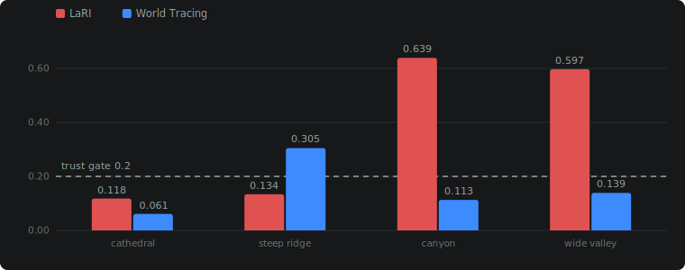

# Atlas Camera — User Guide: Recovery, Projection & Preview

This guide explains three things artists and TDs need a working mental model
of to use Atlas Camera well: how the camera gets **recovered** from a single
image, how the source photo gets **projected** onto derived 3D geometry
(the matte-painting core of the tool), and how the blockout viewport's
**preview dilation** widens what you can see while orbiting without lying
about the actual geometry.

It assumes you've already loaded a workflow (`examples/atlas_camera_core_projection_workflow.json`
is the minimal one) and are looking at the node graph in ComfyUI.

---

## Part 1 — Camera Recovery

Atlas Camera's job is to answer: *given one photo, where was the camera,
what lens was it, and how big is everything?* There are two different
engines that answer the first two questions, and a separate, tiered system
for the third.

### Two solving engines

**Vanishing-point solving** (`AtlasSolveFromImage`, `detect_vanishing_points=True`)
is the classical approach: it finds straight lines in the image, groups them
into 2–3 families that should be parallel in 3D (building edges, road edges,
verticals), and computes where those families *converge* in the 2D image —
the vanishing points. From the geometry of where those points land, it backs
out the camera's focal length and orientation.

This works well on real photographs, which have globally consistent
perspective. It's fragile on **AI-generated images**, whose perspective is
often only *locally* plausible — a building edge that looks straight up
close can subtly bend across the frame, and the multi-line RANSAC fit either
fails outright or confidently converges on the wrong answer (pitched the
wrong direction, focal length off by 2×). Testing across 33 AI-generated
images found this path usable on 18/33, with no real confidence score (it
reports a constant 0.75 whether the fit was rock-solid or barely holding
together).

**Learned camera prior** (`AtlasLearnedSolveFromImage`, powered by GeoCalib)
takes a completely different approach: instead of detecting and triangulating
lines, a neural network trained on millions of images predicts the camera's
focal length and *gravity direction* (which way is "up" in the photo)
directly from image content — shading, object shapes, learned scene priors.
It doesn't need any straight lines to converge correctly, which makes it far
more robust on AI imagery. The same 33-image test set went from 18 usable to
27, with **genuine confidence** that tracks how certain the model actually is.

**Recommendation:** use `AtlasLearnedSolveFromImage` as your default. Fall
back to the vanishing-point path only if you specifically need the classical
VP diagram (see the [Diagram overlay](#reading-the-diagnostics) section) or
are working with a real photograph that has strong, clean architectural lines.

### The metric-scale problem

Neither engine, on its own, knows the *scale* of the scene — a recovered
camera is correct up to an unknown multiplier. A photo of a doll house and a
photo of a real house can produce an identical-looking solve. Something has
to anchor scale to real-world metres. Atlas Camera resolves this through a
**tiered cascade**, evaluated in order of reliability, and — critically —
**nothing is silently promoted**. Each tier only takes over if it clears a
confidence threshold; below that, the candidate is recorded and flagged, but
the previous (safer) tier's value is kept.

| Tier | Node | How it works | Reliability |
|---|---|---|---|
| 1. Reference object | `AtlasReferenceScaleSolve` / `AtlasApplyScaleReferences` | You (or a VLM) mark a known-size object — a person (1.75 m), a door (2.1 m), a car — in the frame. Single-view geometry solves the camera height from that one measurement. | Highest — it's a real measurement |
| 2. Depth ground-plane | `AtlasLearnedSolveFromImage` with `height_mode = measure_from_depth` | A monocular depth model (Depth Anything V2) estimates per-pixel distance; the ground plane is fit from below-horizon pixels and the camera height read off it. | Medium — works, but AI-image depth is often not perfectly ground-plane-consistent |
| 3. Assumed default | `camera_height_m` widget, default 1.6 m | A plain eye-height assumption. | Lowest — always available as a fallback, always flagged as an assumption |

If you want accurate real-world measurements out of the tool (not just a
plausible-looking blockout), **use tier 1** — it's the only tier that's an
actual measurement rather than an inference. The VLM scale-cue nodes
(`AtlasVLMScaleCues` → `AtlasApplyScaleReferences`) can suggest candidate
objects automatically, but always require an explicit `confirm` toggle
before their suggestion is adopted — this mirrors how the whole project
treats any AI-suggested value: propose, never silently apply.

---

## Part 2 — Matte-Painting Projection

This is Atlas Camera's core technology: once you have a solved camera, you
can build simple 3D geometry and **project the original photo onto it from
the recovered camera's point of view** — the same technique matte painters
use in Nuke or Maya with a projection camera, but running live in a ComfyUI
viewport.

### The core idea

A camera projection shader answers one question per point on your 3D
geometry: *"if I looked at this exact 3D point from the SOLVED camera's
position, which pixel of the original photo would I be looking through?"*
It computes that pixel and paints it there. Concretely, for a world-space
point `p`:

1. Transform `p` into the recovered camera's coordinate space (using the
   solved view matrix).
2. Project it to a 2D image pixel using the solved focal length and
   principal point — literally the same pinhole-camera math used to solve
   the camera in the first place, run in reverse.
3. Sample the source photo at that pixel.
4. If the point is behind the camera, or the computed pixel falls outside
   the photo's bounds, there's no data for it — nothing is drawn there.

This is exactly what happens in the blockout viewport when you click
**📽 Project**.

### Why this is robust to depth errors

Here's the property that makes this technique forgiving even when the
underlying 3D reconstruction isn't perfectly accurate: **texels are
assigned by ray, not by depth.** Step 2 above only depends on a point's
*direction* from the camera, not its distance. So if your geometry is
slightly wrong — a wall reconstructed 20% too close or too far — every
point on that wall still projects to the *same* 2D pixel it would at the
correct depth, because it's still on the same ray from the camera.

Practically: from the exact recovered camera position (the **📷 Camera
View** button), the projected image will look pixel-perfect *regardless* of
depth errors in the geometry. Depth errors only become visible as
**parallax** — the image appears to "swim" or misalign — when you orbit
away from that exact viewpoint. This is precisely how a real matte-painting
camera-projection setup behaves in Nuke or Maya, and it's why rough,
approximate geometry is often good enough: you're not asking the geometry
to be dimensionally perfect, only to be *roughly* the right shape and
distance so the parallax stays small within your working range.

### Where the geometry comes from

`AtlasDeriveProjectionGeometry` builds the receiving surfaces for the
projection. The quickest way in is the **`scene_type`** widget — pick
`organic`, `indoor`, or `outdoor` and it sets `geometry_mode`/
`primitive_method`/`depth_model` for you (see the table below for exactly
what each one maps to). Leave it on `manual` (the default) to control those
three independently instead — `scene_type` doesn't add any new solving
behavior, it's purely a shortcut over the same two choices described next.

| `scene_type` | Equivalent manual settings |
|---|---|
| `organic` | `geometry_mode=relief_mesh` |
| `indoor` | `geometry_mode=primitives`, `primitive_method=room_cuboid`, Indoor depth model |
| `outdoor` | `geometry_mode=primitives`, `primitive_method=ransac_planes`, Outdoor depth model |

One thing `scene_type` can't reach: if `AtlasLearnedSolveFromImage` upstream
uses `height_mode=measure_from_depth`, its own separate `depth_model` widget
still needs to be set to match by hand — nodes don't reach across the graph
to configure each other.

**`geometry_mode`** — what kind of geometry to build (set directly, or via `scene_type` above):
- `relief_mesh` (default) — a single triangulated mesh following the actual
  depth contours of the scene. Handles arbitrary, organic shapes (cluttered
  interiors, irregular terrain) but has real gaps ("torn" triangles) at
  sharp depth discontinuities, since a foreground object's silhouette
  genuinely has nothing behind it in a single photo.
- `primitives` — simple shapes (planes, boxes, cylinders) fit to the scene.
  Cleaner, more "blockout"-like, but only as good as the fitting method.
- `both` — both at once (mostly useful for comparison; they'll visually
  overlap).

**`primitive_method`** — which fitting strategy, when `primitives`/`both`
is selected:
- `azimuth_walls` (default) — finds only *vertical* walls plus foreground
  boxes/cylinders. General-purpose, but can't represent a sloped roof.
- `ransac_planes` — finds planes at **any** orientation (roofs, ramps,
  stepped facades) via a 2D orientation histogram + sequential RANSAC.
  Best for exterior architecture.
- `room_cuboid` — assumes an orthogonal room and fits a floor, up to 4
  walls, and an optional ceiling aligned to the dominant wall direction.
  Best for interiors that are genuinely box-shaped; produces confidently
  wrong (skewed) results on non-orthogonal rooms, so pick the right method
  for your shot rather than relying on this to auto-detect.

### The relief mesh's party trick: UV-baked projection

`AtlasExportReliefMesh` writes the relief mesh out as an OBJ (+MTL+texture)
or a self-contained GLB. The detail worth knowing: **every vertex's UV
coordinate is set to its own projected pixel position** — the same
computation described above, baked into the mesh data instead of a live
shader. The practical result: when you import that OBJ into Maya, Nuke, or
ZBrush with its texture, **it's already correctly projected** with zero
setup — no projection camera to build, no UV project-from-camera step. You
can go straight to retopology or UV transfer.

---

## Part 3 — Preview Dilation (Widening Orbit Coverage)

The viewport lets you orbit the camera around to inspect the projected
scene. But there's a hard physical limit worth understanding: **derived
geometry only ever covers what the original camera could see** — a single
photo only contains information about a forward-facing cone. Nothing was
ever reconstructed *outside* that cone, so orbiting far enough eventually
points you at genuinely empty space.

Two independent things address this:

**Orbit angle clamp** — the orbit controller limits rotation to roughly
±80° yaw / ±55° pitch around the camera's own original direction. This
stops you from spinning into the void by accident, while leaving plenty of
room to inspect parallax and occlusion.

**`preview_expand`** (on `AtlasBlockoutViewport`, default 1.0 = off) — dilates the
geometry itself outward from the camera, so more of the visible cone is
actually covered by real surfaces instead of gaps. This uses one equation,
applied consistently regardless of what kind of surface it's touching. For
any point `p` with a local surface normal `n̂` (which direction is
"outward" — a wall's fixed normal, or a mesh vertex's own, individually
varying normal), radiating from the camera position as a pivot:

```
p' = pivot + ((p − pivot)·n̂) n̂  +  scale · [(p − pivot) − ((p − pivot)·n̂) n̂]
```

In plain terms: split the point's offset from the camera into two parts —
the part *along* its own facing direction (how far away it is, front-to-back)
and the part *sideways* to that (how far off to the side it is). Only the
sideways part gets multiplied by `scale`. A wall grows wider without
drifting toward or away from the camera; a box or cylinder (which doesn't
have one single facing direction) just grows uniformly from the camera; the
relief mesh grows per-vertex, each vertex using its own individual normal.

This is applied **only when building the viewport's display data** — it
never touches the actual geometry used for `AtlasExportReliefMesh` or any
DCC export, and never affects a metric measurement. Turning `preview_expand`
up to see more of the scene while orbiting has zero effect on the accuracy
of anything you export.

**Trade-off with 📽 Project — leave this at 1.0 whenever you're using
projection.** Dilated geometry is, by definition, surface the camera never
actually photographed, so there's no real pixel data to project onto it —
the projection shader correctly renders it as empty/black. Because the
dilated fringe dominates the view away from dead-center, this shows up as
large black regions after only a *moderate* orbit, not just at the extreme
edge of the allowed arc. Raise `preview_expand` only when you're inspecting
undressed grey blockout shapes and don't need Project active; the default
of 1.0 keeps Project fully accurate at any orbit angle within the arc.

---

## Part 4 — Output Desk, Proxy Preview, and Float-Safe Plates

Atlas now separates the interactive viewer from final delivery data:

- **Viewer** — `AtlasBlockoutViewport`, the browser-side Three.js preview.
  It is for orbiting, placing geometry, checking projection, authoring camera
  paths, and generating proxy/LDR render passes.
- **Output Desk** — `AtlasViewportControls`, still compatible with the old
  detached-controls link, but now presented as an NLE-style control surface
  with `View`, `Plates`, `Color`, `Passes`, and `Path` tabs.
- **Plate references** — file-backed source/patch/clean plates registered by
  `AtlasRegisterPlate` and attached to a solve with `AtlasAttachSourcePlate`.
  These are the final source of truth for EXR/float workflows.

The browser viewport is intentionally **not** the final render path. Its
`Render Proxy Passes` and `Bake Proxy Path` actions still fill the usual
`shaded`, `depth`, `normal`, `mask`, and `path_frames` IMAGE outputs, but
those images travel through ComfyUI as 8-bit-ish browser/base64 preview data.
They are useful for editorial previews, ControlNet references, quick review,
and feeding a video-combine node. They are not a substitute for a final EXR
projection render in Nuke, Maya, Resolve, or an OCIO-aware writer.

### Registering final plates

Use `AtlasRegisterPlate` when the source image also exists on disk as a real
plate, especially an EXR:

1. Feed it the same ComfyUI `IMAGE` used by the solve.
2. Set `plate_path` to the original plate path, for example
   `D:/show/shot010/plates/hero_main.exr`.
3. Set `colorspace` to the plate's real working colorspace, commonly
   `ACEScg`, `ACES2065-1`, or the camera/log colorspace you intend to manage
   downstream.
4. Feed `plate_ref` into `AtlasAttachSourcePlate`.
5. Use the attached solve for viewport/export nodes.

If `plate_path` is left blank, Atlas marks the plate as **proxy-only**. The
browser still has a JPEG preview, but exporters will not pretend that preview
is final float image data.

Patch and clean-plate projection sources follow the same model. Their
`image_b64` preview keeps the viewport interactive, while the optional
`plate_ref` tells Nuke/Maya/export nodes which original EXR or high-bit-depth
file should be used for final projection.

### Color controls are preview intent, not full OCIO

The Output Desk's Color tab stores an `ATLAS_OUTPUT_PROFILE`: config label or
path, working colorspace, output colorspace, display, view, and display trim.
(Look, LUT path, exposure, and gamma widgets were removed as redundant — the
viewport's own ☀ Exposure control covers preview brightness; the profile
schema still carries those fields at neutral defaults for downstream
compatibility.) The browser uses that information for
labels and lightweight display-inferred preview trims only. It does **not**
run a full OpenColorIO processor in WebGL.

Final color fidelity belongs downstream:

- Nuke exporters create Read nodes from the original plate path when one is
  available and annotate/set the intended colorspace.
- Maya exporters point projection file nodes at the original plate path when
  one is available and store the color-management hints on the node.
- `AtlasExportReliefMesh` writes OBJ/MTL projection UVs and references the
  original file-backed plate when available. GLB remains a preview/proxy
  format with embedded PNG-style texture data.
- ComfyUI-OCIO's `OCIOWrite` can still consume proxy `path_frames` for
  editorial previews, while final float renders should be produced from the
  registered plates and exported cameras/geometry in a DCC or comp package.

The practical rule: **browser output is for deciding and previewing; plate
refs plus output profiles are for final handoff.**

---

## Reading the diagnostics

The blockout viewport toolbar has a set of diagnostic controls, useful for
sanity-checking a solve and, since 2026-07-09, for tuning the layer stack:

- **☀ Exposure** — a tone-mapped brightness slider for the lit (grey)
  preview material. Has no effect on the projected photo itself (which is
  raw pixel data, not re-lit) or on the depth/normal/mask render passes.
- **📊 Diagram** — a layered overlay showing the solved vanishing points
  (orange/blue/green for left/right/vertical), the horizon line, and a
  shaded ground region, each independently dimmable. **The vanishing-point
  layer is empty when using the learned (GeoCalib) solve** — it doesn't
  compute VPs at all, by design. Horizon and ground still show correctly on
  either solving path.
- **ℹ Info** — a text HUD with the solved lens (focal length in mm + field
  of view), sensor size, camera height, an estimated scene depth, overall
  confidence, which solving method was used, and which scale tier was
  adopted. Useful for quickly checking "did this solve pick up a real
  camera height, or is it still on the assumed default?"
- **🎨 Layers** — opaque per-layer identity tints with an on-canvas legend:
  which layer (base, foreground, X-ray, sky, patches) paints each pixel.
  **Black means nothing paints — always a finding.** The single most useful
  toggle when tuning a multi-layer graph.
- **🩻 X-ray** — tints exactly the pixels whose geometry was *invented* by a
  hidden-geometry backend (red = LaRI, blue = World Tracing), only under
  📽 Project. At camera view it should show nothing at all.
- **💡 Lights** — two movable point lights (default intensity 0 = no effect)
  for a stylised relight bias on the projected photo and real lighting on
  the grey preview.

---

## Quick reference: node → concept

| Node | Concept from this guide |
|---|---|
| `AtlasLearnedSolveFromImage` | Part 1 — learned camera recovery |
| `AtlasSolveFromImage` | Part 1 — classical vanishing-point recovery |
| `AtlasReferenceScaleSolve`, `AtlasApplyScaleReferences` | Part 1 — scale tier 1 (reference object) |
| `AtlasVLMScaleCues` | Part 1 — automatic reference-object suggestions (needs `confirm`) |
| `AtlasDeriveProjectionGeometry` | Part 2 — geometry derivation (`scene_type`, `geometry_mode`, `primitive_method`) |
| `AtlasBlockoutViewport` (📽 Project) | Part 2 — the live camera projection |
| `AtlasExportReliefMesh` | Part 2 — UV-baked mesh export for Maya/Nuke/ZBrush |
| `AtlasBlockoutViewport` (`preview_expand`) | Part 3 — preview-only geometry dilation |
| `AtlasRegisterPlate`, `AtlasAttachSourcePlate` | Part 4 — file-backed float-safe source plates |
| `AtlasViewportControls` | Part 4 — Atlas Output Desk and OCIO-style output profile |
| `AtlasBlockoutViewport` (☀ / 📊 / ℹ / 🎨 / 🩻) | Diagnostics — exposure, VP/horizon diagram, camera HUD, layer identity, invented-geometry provenance |
| `AtlasDepthMap` | One shared metric depth estimate, fanned out to every layer node |
| `AtlasDeriveReliefMesh` | The base mesh + backdrop under every layered workflow |
| `AtlasCleanPlateLayer` / `AtlasDepthLayerMask` / `AtlasSkyDomeLayer` | The layer stack (see the 2026-07-09 section below) |
| `AtlasPredictHiddenGeometry` 🔬 | Experimental X-ray depth — predicted geometry behind occluders |

---

## What's new (2026-07-08) — the complete DMP workflow

This guide's three mental models still hold. On top of them, the hero
workflow (`examples/atlas_camera_master_dmp_workflow.json`) now assembles the
full matte-painting pipeline: a **VLM pre-flight** that assesses your photo
and recommends settings (the graph pauses until you click ▶ Continue), **sky
separation** onto a far card driven by a SAM segmentation (with deterministic
edge-extend and frame outpaint so orbits don't reveal black), **depth-band
clean plates** with per-pixel edge mattes and disocclusion fill, **📐 Extract
Angle** (orbit to the view you want a patch at; the Qwen novel-view
generation, patch placement, and exports all pick up your extracted angle
automatically), and **all-in-one layer exports** to Nuke (.nk) and Maya
(.ma, verified in Maya 2027). See ECOSYSTEM_GUIDE.md's 2026-07-08 addendum
for how each piece works and why.

---

## What's new (2026-07-09) — the five-layer stack and the X-ray track

Two things changed: the default depth model, and how layered workflows are
architected. If you use the shipped hero workflows you get both automatically.

### The depth model is now DA3

`depth-anything/DA3METRIC-LARGE` replaced Depth Anything V2 as the default
everywhere. DA3 emits *canonical* depth that Atlas converts to metres using
the **focal length the camera solve already recovered** — so depth scale
inherits the solve's accuracy instead of guessing a lens. Measured on the 4K
test set: ~3× fewer relief-mesh tears on two of four scenes, and a usable
mesh on a pitched shot where V2's shattered to zero faces. V2 remains
selectable in every depth combo.

### Every hidden-geometry workflow is the same sandwich


Back to front: a **sky dome** (outdoor scenes — a SAM "sky" mask drives a far
card with clean skyline mattes), the **base relief mesh + backdrop** (its
plate is the clean-plate composite, feathered over the occluders so
background geometry never carries baked-in foreground pixels), the **X-ray
layer** (predicted hidden geometry painted with a LaMa-inpainted plate —
only visible at true reveals), and the **foreground layer** (the original
photo, matte-cut at the real silhouettes — this is what keeps camera view
honest). Tears in the base mesh are *load-bearing*: they're the openings the
deeper layers show through.

Tuning loop: queue at defaults → **🎨 Layers** and fix any black or
wrong-color region by adjusting the foreground band (and SAM prompts) until
subjects are solid orange → read the 🔬 node's report (registration rel MAD
under 0.2 = trust it; above = switch backends) → orbit with **🩻** to judge
reveals. One knob per queue.

### The X-ray track (experimental, research-only)

`AtlasPredictHiddenGeometry` 🔬 predicts, per pixel, the stack of surfaces
each camera ray pierces (LaRI or World Tracing backends — both are
user-installed clones with non-commercial terms; see THIRD_PARTY.md), and
substitutes hidden depth behind your foreground occluders so a dolly-in
reveals *predicted geometry with inpainted pixels* instead of holes. Backend
choice is per-scene, not per-taste — the node prints its registration
quality every run, and the shipped heroes encode the measured winner per
scene:



Six calibrated per-scene workflows ship in `examples/`
(`atlas_camera_hidden_geometry_*_workflow.json`) — cathedral, space hangar,
jungle temple, canyon, steep ridge, wide valley — each with a dolly-in bake
wired to video. Start from the one whose scene most resembles your shot.

### Where to read more

- [🥞 Build-Up Guide](https://claude.ai/code/artifact/77b10784-a6d5-4def-89bd-84cbfaabc21e) — the layer stack taught stage by stage, with tuning tables.
- [🎞 Examples Catalog](https://claude.ai/code/artifact/186c3a6a-a778-40f0-8f39-fe29cfa6aace) — every shipping workflow with its scene, settings, and dependencies.
- [📊 Technical Details](https://claude.ai/code/artifact/4781289c-50dd-47fc-8571-1ef67513b7ba) — the measured numbers behind every default on this page.

